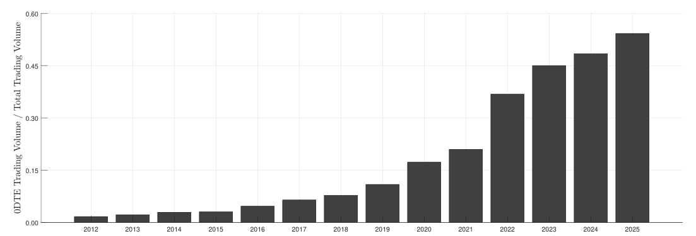
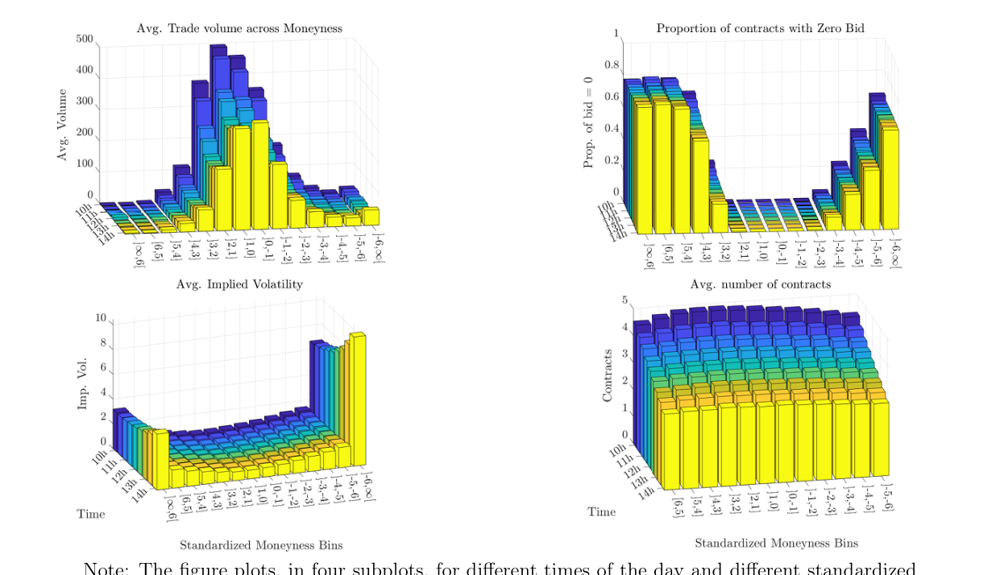
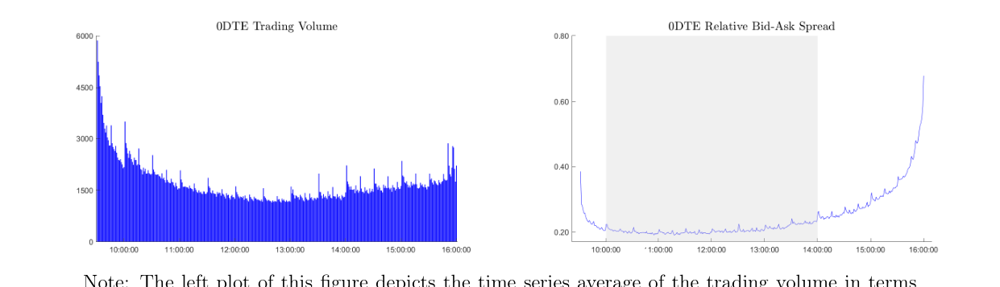
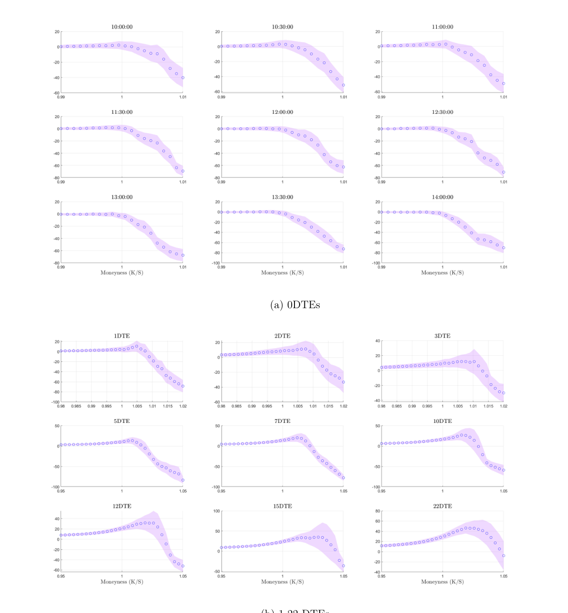
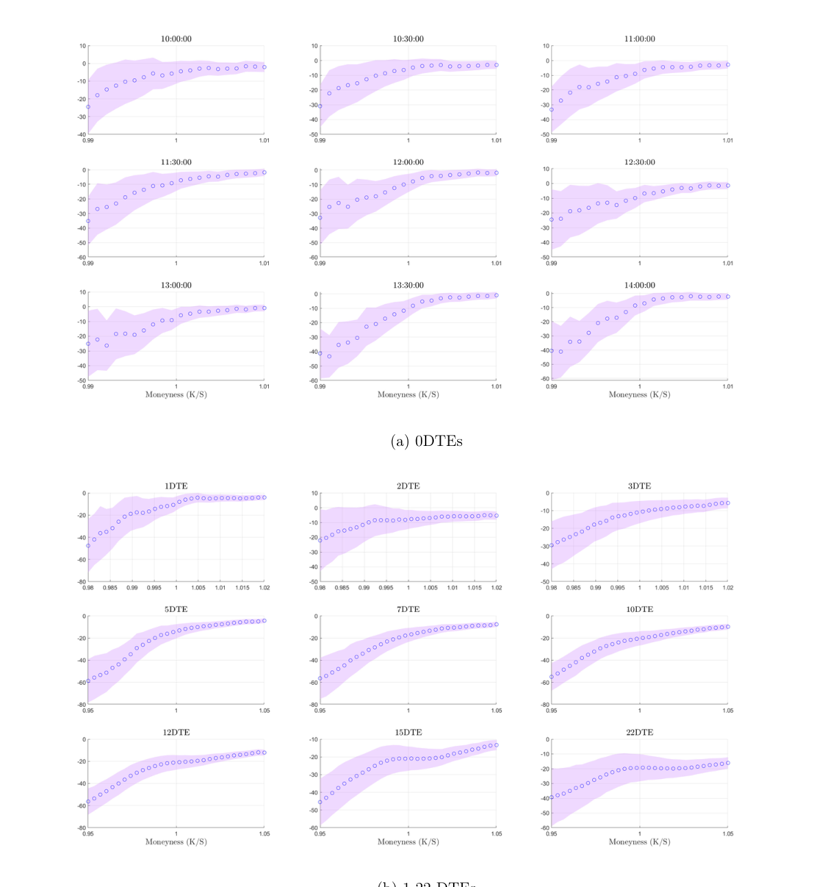
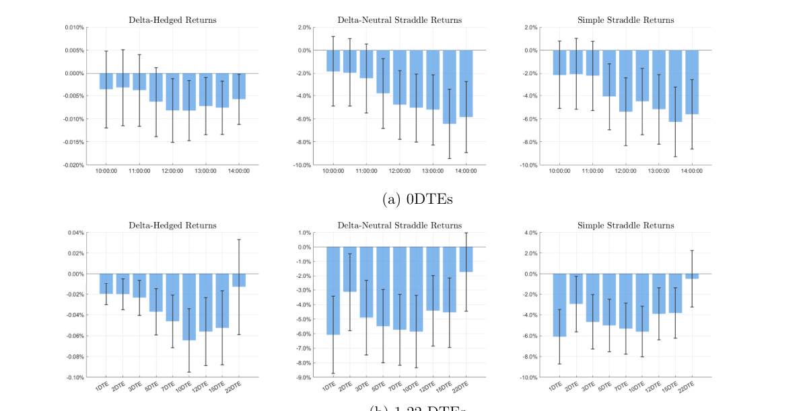
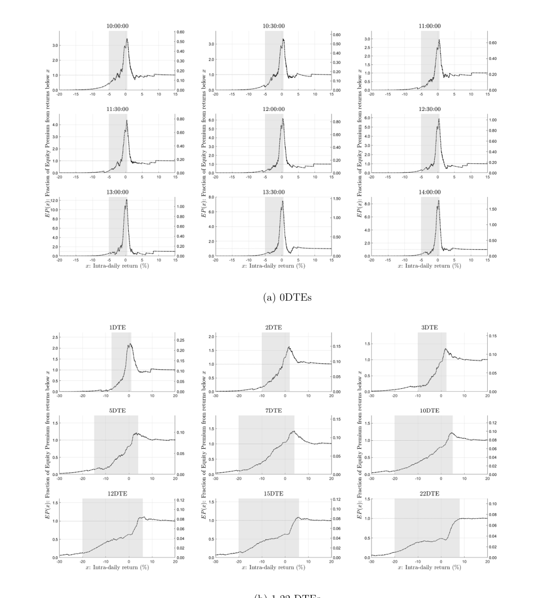
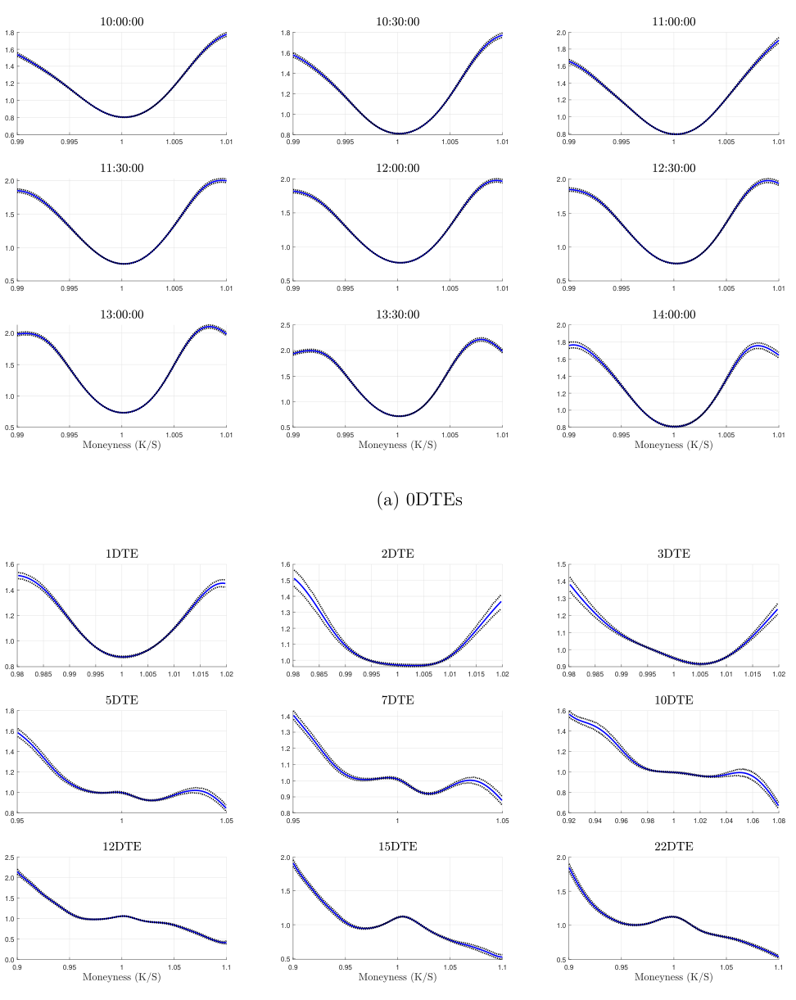
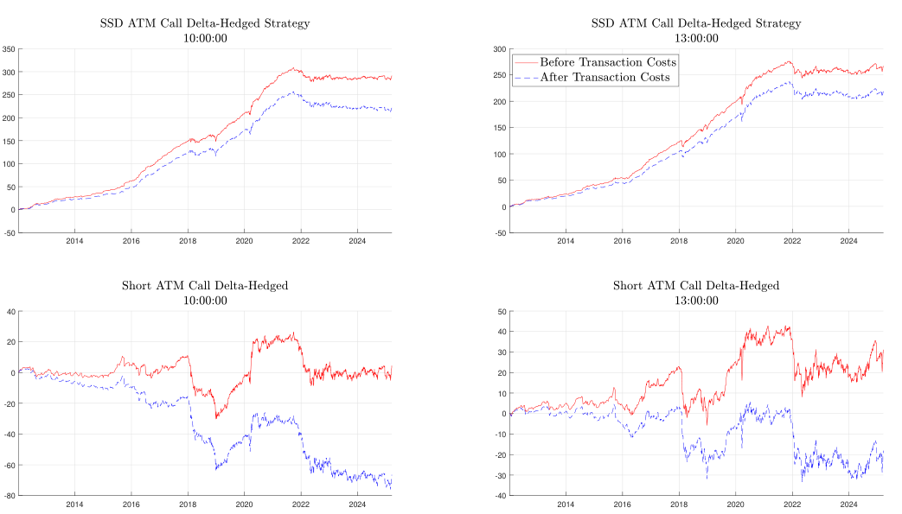

## 0 DTE Asset Pricing∗

Caio Almeida†a, Gustavo Freire‡b, and Rodrigo Hizmeri§c aPrinceton University bErasmus University Rotterdam, Tinbergen Institute & ERIM cUniversity of Liverpool

This draft: June 20, 2025 First draft: January 20, 2024

### Abstract

We document new asset pricing stylized facts implied by zero days-to-expiration (0DTE) options, which now comprise half of total S&P 500 option volume, and contrast them to those of longer-maturity contracts. A distinctive feature of the 0DTE market is that investors require more compensation for positive market re- turns than for negative returns. This is reflected in a high variance risk premium, which is mainly driven by compensation for upside risk and negatively predicts market returns. Moreover, the majority of 0DTEs violates price bounds associated with risk-averse investors. A trading strategy exploiting these violations is highly profitable up to 2022, but dissipates after the daily availability of 0DTEs, consistent with growing integration with the underlying market in recent years.

Keywords: zero days-to-expiration (0DTE) options, equity premium, variance risk premium, pricing kernel, option returns.

JEL Classification: G11, G12, G13.

∗We would like to thank Oleg Bondarenko (discussant), Stefanos Delikouras (discussant), Can Gao, Elise Gourier (discussant), Hyung Joo Kim (discussant), Alex Kostakis, Paola Pederzoli (discussant), Tobias Sichert, conference participants at the Cancun Derivatives and Asset Pricing Conference 2024, TSE Financial Econometrics Conference 2024, 16th Annual SoFiE Meeting, Liverpool Workshop in Option Markets, 24th Brazilian Finance Meeting, "Frontiers of Option Pricing" session at the Econometric Society Summer Meeting 2024, Paris December Finance Meeting 2024, MFA 2025 Annual Meeting, Barcelona Workshop in Financial Econometrics 2025 and St.Gallen Financial Economics Workshop 2025, and seminar participants at TwinBeech Capital and SMLFin Seminar Series for useful comments. †calmeida@princeton.edu, Department of Economics, Princeton University. ‡freire@ese.eur.nl, Erasmus School of Economics - Erasmus University Rotterdam, Tinbergen Institute and Erasmus Research Institute of Management (ERIM). §r.hizmeri@liverpool.ac.uk, University of Liverpool Management School, University of Liverpool.

## 1 Introduction

We investigate the asset pricing implications of a new, relatively unexplored market:

zero days-to-expiration (0DTE) S&P 500 options, i.e., options on the market index ex- piring by the end of the same day. These are weekly options that were listed at least

a week before. Since May 2022, weeklies are listed every trading day by the Chicago

Board Options Exchange (CBOE), resulting in the daily availability of 0DTE options.

While one-month options were among the most traded contracts up to ten years ago, which partially justified the focus on these options by the literature, the landscape of

the option market has changed dramatically more recently. Today, the daily volume of

0DTEs accounts for around half of total S&P 500 option volume, being thus by far the most traded maturity. The tremendous growth of these ultra short-maturity options has

made them a trending topic in financial media outlets, trader forums and social media.

Our interest in 0DTE options is justified not only by the fact that they are now the most traded options in the market, but also because they contain new, valuable

information about investors' risk preferences and risk premia over intra-daily horizons.

Our goal is to extract this information by exploring, from different perspectives, how

0DTE option prices relate to the time series of high-frequency market returns. Our analysis provides new asset pricing stylized facts for ultra short-horizons and highlights

how they are remarkably different from the empirical evidence of longer horizons.

We focus on two main questions. First, what is the compensation required by investors for bearing market risks over the day? The answer to this question is directly related to the

intra-day pricing kernel implied by 0DTEs and its shape as a function of market returns.1

We document a number of patterns in the equity and variance risk premia that are aligned with a nonmonotonic pricing kernel that is higher for positive returns than negative

1Starting with Jackwerth (2000), Aït-Sahalia and Lo (2000) and Rosenberg and Engle (2002), a large literature estimates this pricing kernel for longer horizons and documents a nonmonotonic shape, which is puzzling under a representative investor framework. See Cuesdeanu and Jackwerth (2018) for a survey.

returns, revealing that investors mainly require compensation for upside risk during the day. Second, are 0DTE option prices consistent with risk-averse investors? We find

that violations of stochastic dominance increase as maturity shortens, with most 0DTEs appearing "mispriced".2 A trading strategy exploiting this mispricing is highly profitable

before 2022, but dissipates after the daily availability of 0DTEs. This is consistent with growing market efficiency and stronger integration of the underlying and option markets.

We start by analyzing average returns of 0DTE call and put options across strikes.

These are informative about investors' preferences over intra-day market return states, i.e., about the shape of the pricing kernel projected onto market returns over the op-

tions horizon. Calls experience low returns overall, which decrease with the strike and eventually get highly negative. Following the rationale of Bakshi, Madan, and Panayotov

(2010), this is evidence that the pricing kernel is increasing for some region of positive market returns, violating monotonicity. Put returns are also negative, especially out-of-

the-money (OTM), indicating that the pricing kernel is a decreasing but steep function of market returns in the negative return region, consistent with aversion to downside risk.

Such risk preferences have strong implications for the equity premium over intra- daily horizons. Applying the decomposition of Beason and Schreindorfer (2022) to 0DTE

options and realized market returns, we find that most of the intra-day equity premium stems from compensation to market returns between −5% and 0%. In contrast, positive

return states have a negative contribution. This happens when the pricing kernel is nonmonotonic and marginal utility is high for positive market returns. In this case,

investors would be willing to pay a premium to hold Arrow-Debreu securities paying in those states, i.e., they are willing to give up part of the compensation for equity risk.

Implications are also substantial for the variance risk premium. We first document

2We emphasize that "mispriced" here means only that we cannot reconcile 0DTE prices with informa- tion from the underlying market under risk-averse preferences. This does not mean that 0DTEs violate no-arbitrage conditions (which imply much wider bounds that 0DTEs in general satisfy) or that it is not possible to price 0DTEs with an option pricing model (see, e.g., Bandi, Fusari, and Renò, 2023).

that the average returns of at-the-money (ATM) delta-hedged calls and straddles are sig- nificantly negative. Since these strategies represent long positions in volatility, this means

that investors are willing to pay a high premium to be protected against variance risk over the day (Bakshi and Kapadia, 2003; Coval and Shumway, 2001). This is confirmed

when we compute a direct estimate of the variance risk premium, similarly to Bollerslev,

Tauchen, and Zhou (2009). The (annualized) average variance risk premium implied by

## 0 DTEs can be up to four times larger than what is observed for longer horizons.

To disentangle the compensation demanded by investors to bear variation risk in positive versus negative market returns, we respectively compute the "good" and "bad"

components of the total variance risk premium, as in Kilic and Shaliastovich (2019).

Strikingly, while at the one-month horizon the "good" variance risk premium is negative and the "bad" is highly positive, the upside risk premium increases as the option maturity

shortens, until it becomes larger than the premium for downside risk over intra-daily horizons. This, again, would be consistent with a pricing kernel that is exceptionally

high for positive market returns, such that investors demand compensation for these states of high marginal utility.

We further investigate whether 0DTE options contain predictive information for excess market returns over the day. We consider predictive regressions using the variance risk

premium, risk-neutral moments (Bakshi, Kapadia, and Madan, 2003) and the equity premium lower bound of Martin (2017). From these variables, only the variance risk

premium significantly predicts returns, but with a negative coefficient, which is at odds with the existing evidence for longer horizons (Bollerslev et al., 2009). By substituting

the total variance risk premium with its "good" and "bad" components, we find that only the "good" component helps predict market returns, with a strong and statistically

significant negative sign. In other words, the compensation for upside risk drives the result for the total variance risk premium. This negative relation is, once more, aligned

with high marginal utility in states of positive market returns: the higher the pricing kernel in this region, the higher is the compensation for positive return variation risk and

the more negative is the contribution of positive return states to the equity premium.

The findings above provide indirect evidence that the intra-day pricing kernel as a function of market returns is nonmonotonic and, in particular, high for positive returns.

To confirm this evidence, we directly estimate the pricing kernel implied by 0DTE options and high-frequency market returns. For comparison, we also estimate pricing kernels for

maturities up to one month. Over our sample, the average pricing kernel is mostly decreasing across returns when considering horizons between two weeks and one month,

while as maturity shortens, a U-shaped pattern starts to appear. The pattern is more pronounced for 0DTEs, where the pricing kernel is actually higher for positive market

returns than negative returns. This reveals that, over recent years, the nonmonotonicity of the pricing kernel has shifted to shorter maturities.

Our evidence shows that 0DTE option prices can only be jointly reconciled with the physical distribution of market returns under a pricing kernel displaying pronounced

nonmonotonicity. However, if we entertain the possibility that the 0DTE option market is segmented, there could still be a different risk-averse trader in the market index that

is marginal in each option. To test for that, we compute, for each option, price bounds from the physical distribution consistent with all pricing kernels that are monotonically

decreasing in market returns (Ritchken, 1985). Over our sample, only around 30% of

0DTE options (and 6% of the ATM options) satisfy these bounds, which is again in stark contrast with evidence from longer horizons (Almeida and Freire, 2022). In fact, we

show that around 97% of one-month options satisfy stochastic dominance bounds, while violations increase monotonically as maturity shortens.

As a result, 0DTE options are mostly "mispriced", in the sense that they do not re- flect the risks implied by the time series of intra-day market returns under risk-averse

preferences. To assess the economic significance of this mispricing, we consider a trad- ing strategy purchasing (writing) the delta-hedged ATM option if it is cheap (expensive)

according to risk-averse investors, i.e., if its price represents a lower (upper) bound vio- lation. Up to 2022, this strategy is highly profitable, even after transaction costs, with

a Sharpe ratio about ten times as large as that obtained by always writing the delta- hedged ATM option, that is, exploiting the variance risk premium. However, after the

daily availability of 0DTEs and the associated increase in liquidity and attention to these options, the profitability dissipates. This indicates that the 0DTE market has become

more efficient and closely integrated with the underlying market over the recent years.

The remainder of the paper is organized as follows. After a brief discussion of the related literature, Section 2 describes the theoretical framework behind our analysis.

Section 3 presents the data and implementation details of the methods we use. Section 4 contains our empirical analysis. Section 5 reports robustness results with respect to

different subsamples, monetary policy announcements, using E-mini S&P 500 futures instead of the cash index, and alternative pricing kernel estimates. Section 6 concludes

the paper. Appendix A collects the figures and tables of the paper.

### 1.1 Related literature

Our paper mainly relates to three strands of the literature. The first strand consists of an increasing number of papers studying the new 0DTE option market from different

lenses. Brogaard, Han, and Won (2023) show that a higher fraction of 0DTE option trading increases the volatility of the underlying asset, while Dim, Eraker, and Vilkov

(2024) and Adams, Fontaine, and Ornthanalai (2024) provide contrary evidence based on net open interest measures. Beckmeyer, Branger, and Gayda (2023) document that 0DTE

options are popular among retail traders, even though these investors mainly experience

losses in this market.3 Bandi et al. (2023) present a novel option pricing formula designed for 0DTEs and investigate how leverage and volatility-of-volatility affect instantaneous

risk premia. Vilkov (2023) explores the performance of 0DTE option trading strategies.

Focusing on 1DTE options instead, Johannes, Kaeck, Seeger, and Shah (2024) analyze option returns around macroeconomic announcements. Chong and Todorov (2024) use

0DTEs to show that there is no segmentation between the equity and option markets based on restrictions for how short-horizon volatility should behave.4 We contribute by

recovering investors' risk preferences implied by 0DTEs, analyzing their implications for intra-day equity and variance risk premia, examining whether these options are integrated

with the underlying market in the stochastic dominance sense, and comparing these findings to those from longer-maturity options.

The second strand recovers information about investors' expectations and risk prefer- ences from relatively long-maturity options. Jackwerth (2000), Aït-Sahalia and Lo (2000)

and Rosenberg and Engle (2002) estimate the projection of the pricing kernel onto market return states. Almeida and Freire (2022) find that S&P 500 option prices satisfy bounds

consistent with risk-averse investors, where the preferences of the marginal agent vary across the options. Beason and Schreindorfer (2022) decompose the equity premium into

different parts of the return state space. Bollerslev et al. (2009) show that the variance risk premium is generally positive and helps predict market returns. Bollerslev, Todorov,

and Xu (2015) and Andersen, Fusari, and Todorov (2015, 2017) document the special role of compensation for jump risk in determining market risk premia. Using information

from the new 0DTE market, which is the most relevant option market today, we provide novel asset pricing stylized facts for intra-daily horizons that are strikingly different from

those obtained for longer horizons. In particular, we study the intra-day pricing kernel

3While 0DTE options account for more than 75% of retail trading in S&P 500 options, the vast majority of 0DTE S&P 500 trading (around 94%) is still attributable to institutional investors. 4As an implication of their result, the aggregate pricing kernel that reconciles 0DTE option prices with high-frequency market returns exists, which is the object of our study.

implied by 0DTEs.5

The third literature strand investigates return predictability over relatively short hori- zons. Gao, Han, Zhengzi Li, and Zhou (2018) and Baltussen, Da, Lammers, and Martens

(2021) document intra-day momentum patterns across different markets, relating them to infrequent portfolio rebalancing and hedging demand, respectively. Aït-Sahalia, Fan,

Xue, and Zhou (2022) study the predictability of ultra high-frequency stock returns us- ing machine learning methods. Aleti, Bollerslev, and Siggaard (2023) predict intra-day

market returns with high-frequency cross-sectional returns of the factor zoo. Almeida,

Ardison, Freire, Garcia, and Orlowski (2023), Almeida, Freire, Garcia, and Hizmeri (2023) and Alexiou, Bevilacqua, and Hizmeri (2023) use high-frequency market returns, cross-

sectional stock returns and option returns, respectively, to estimate volatility and tail risk measures and predict risk premia over daily horizons. We show that 0DTEs contain

useful predictive information about intra-day risk premia over the options horizon. More specifically, the variance risk premium negatively predicts excess market returns over the

day, which is driven by a strong negative relation between the premium for positive return variation risk and future market returns.

## 2 Theoretical background

In this section, we present the theoretical background behind our analysis of the asset pricing implications of 0DTE options. We first describe what is the pricing kernel implied

by options. Then, we discuss its relation with expected option returns, market risk premia and option price bounds. Finally, we explain how this framework will be used to study

the 0DTE option market.

5Relatedly, Aleti and Bollerslev (2024) study intra-day realizations of a pricing kernel obtained from high-frequency returns of factors constructed from a monthly conditioning set of variables. In contrast, the pricing kernel we analyze is a function of market returns that is forward-looking and conditional on the investors' information set at the time of the day that the 0DTE options are observed.

### 2.1 The pricing kernel

In the absence of arbitrage, the current price Pt of any asset is given by the expectation of the future asset payoff XT at time T = t + τ multiplied by the pricing kernel mt,T:

$$Pt = EP[mt,TXT|Ft] ≡ Z XT(s) mt,T(s) πP t,T(s) ds, \qquad (1)$$

where s represents the state of the economy, Ft is the information available to investors at time t and πP t,T(s) is the probability density function (PDF) under the physical measure

Pt. The pricing kernel distorts the physical measure as to reflect investors' compensation for risk, such that one can take simple expectations to calculate the price of any asset.

More specifically, given the almost sure positivity of mt,T under no-arbitrage, the pricing kernel induces a change of measure from the physical measure Pt to the risk-

neutral measure Qt. Given a risk-free rate Rf from t to T, this can be seen by noting that Et[mt,T] = 1/Rf, and dividing and multiplying (1) by Et[mt,T]:

Z XT(s) πQ t,T(s) ds ≡1

Z XT(s) mt,T(s)

Et[mt,T] πP t,T(s) ds = 1

Pt = 1

Rf EQ[XT|Ft], (2)

Rf

Rf where πQ t,T(s) is the PDF under the risk-neutral measure Qt. This PDF is often called the state-price density, as it defines the (forward) prices of Arrow-Debreu securities paying

one dollar at time T if state of nature s is realized, and zero elsewhere. In contrast, πP t,T(s) can be interpreted as the expected payoff of an Arrow-Debreu security for state s.

From (1) and (2), it becomes evident that the pricing kernel is the ratio of discounted risk-neutral probabilities and physical probabilities:

$$πQ t,T(s) πP t,T(s). \qquad (3)$$

mt,T(s) = 1

Rf

The economy-wide pricing kernel above depends on the realization of the state s of the

economy. However, there is no consensus among researchers on which are the relevant state variables to consider from a modeling perspective.

As an alternative, a large strand of the literature, starting with Jackwerth (2000), Aït-

Sahalia and Lo (2000) and Rosenberg and Engle (2002), has proposed to focus instead on the projection of the pricing kernel onto states Rt,T of the market return:

$$πQ t,T(Rt,T) πP t,T(Rt,T). \qquad (4)$$

mt,T(Rt,T) = 1

Rf

The main advantage is that this projection can be estimated using S&P 500 options and the time series of market returns. On the one hand, the seminal result of Breeden and

Litzenberger (1978) allows to recover from option prices across different strikes the risk- neutral distribution of underlying returns over the maturity τ of the options, πQ t,T(Rt,T).

On the other hand, historical market returns are informative about the physical dis- tribution πP t,T(Rt,T).6 Importantly, mt,T(Rt,T) has the same pricing implications as the

economy-wide pricing kernel mt,T(s) for assets with payoffs that depend only on Rt,T.

The focus on the projection of the pricing kernel onto S&P 500 returns is also justified by the general interest in learning about investors' risk preferences towards the market

index and associated equity and variance risk premia. In particular, if one assumes that the market index is equal to the aggregate wealth and a representative agent exists,

mt,T(Rt,T) is the marginal utility of this agent. Under this interpretation, the pricing kernel should be monotonically decreasing in market returns if the representative agent

is risk-averse. However, the literature provides extensive evidence for monthly or longer horizons that mt,T(Rt,T) is usually a nonmonotonic (generally U-shaped) function of mar-

ket returns instead, characterizing the pricing kernel puzzle (Cuesdeanu and Jackwerth,

6There is a potential mismatch of conditioning information sets when estimating πQ t,T (Rt,T ) with option prices, that are forward-looking, and πP t,T (Rt,T ) with historical returns, that are backward-looking (see, e.g., Linn, Shive, and Shumway, 2018). We discuss how we handle that empirically in Section 3.4.

2018).7 In the next subsections, we discuss how various objects of interest in our analysis relate to the pricing kernel and its shape.

### 2.2 Expected option returns

The shape of the pricing kernel has direct implications for expected option returns.

$$The expected return of a call option can be defined as below:8 \muc t(St, Rt,T, K) = Et[max(StRt,T −K, 0)] Et[max(StRt,T −K, 0) mt,T(Rt,T)] −1, \qquad (5)$$

where St is the market index at t and K is the option strike price. The expected return of

a put option is analogously defined for the payoff max(K −StRt,T, 0). The numerator in

(5) is the expected payoff of the option under the physical measure, while the denominator is the expected payoff under the risk-neutral measure, i.e., the option price.

Coval and Shumway (2001) show that if mt,T(Rt,T) is monotonically decreasing, calls

(puts) have expected returns that are positive (negative) and increase with the strike price. Intuitively, a monotonically decreasing mt,T(Rt,T) shifts probability mass towards

states where the call (put) is less (more) valuable. Therefore, as the strike increases, the call price decreases by more than the expected payoff, increasing the expected return.

Conversely, as the strike decreases, the put price decreases by less than the expected payoff, decreasing the expected return. If, instead, the pricing kernel is a U-shaped

function of returns (i.e., increasing for some region of positive returns), Bakshi et al.

(2010) show that expected call returns are decreasing in the strike and negative beyond a strike threshold. This is because mt,T(Rt,T) shifts probability mass towards states

where the call option is more valuable, such that the call price decreases by less than the

7More recently, Almeida and Freire (2023) show that if one interprets mt,T (Rt,T ) as representing the preferences of a marginal agent in the option market instead of a representative investor, a nonmonotonic shape is not puzzling but rather reflects the risk exposures from the marginal agent's options positions. 8To see that, note that Et[ max(StRt,T −K,0) Et[max(StRt,T −K,0) mt,T (Rt,T )]] = Et[max(StRt,T −K,0)] Et[max(StRt,T −K,0) mt,T (Rt,T )].

expected payoff as the strike increases, decreasing the expected return.9

### 2.3 Equity premium

The shape of mt,T(Rt,T), or, equivalently, how πQ t,T(Rt,T) relates to πP t,T(Rt,T), is infor- mative about which return states are compensated via the equity premium. To see that,

first note that the conditional equity premium can be written as:

Et[Rt,T] −Rf = Z ∞

$$0 Rt,T[πP t,T(Rt,T) −πQ t,T(Rt,T)]dRt,T. \qquad (6)$$

To decompose the unconditional equity premium, Beason and Schreindorfer (2022) take the unconditional expectation of (6) and consider net market returns ˜R = R−1 to define:

$$R x −1 ˜R [πP( ˜R) −πQ( ˜R)]d ˜R R ∞ −1 ˜R [πP( ˜R) −πQ( ˜R)]d ˜R , \qquad (7)$$

EP(x) = where πP( ˜R) = E[πP t,T( ˜Rt,T)] and πQ( ˜R) = E[πQ t,T( ˜Rt,T)]. EP(x) measures the fraction of the average equity premium that is associated with market returns below x.

Returns around zero contribute only marginally to the equity premium (as ˜R ≈0), such that EP(x) is expected to be flat around those states. Outside this region, the shape

of the EP(x) function will depend on the shape of the (average) pricing kernel. Under a monotonically decreasing pricing kernel, every state ˜R contributes positively to the equity

premium, i.e., EP(x) is always increasing. To see that, note that in the negative return region, ˜R < 0 and the pricing kernel is above 1, which means that πP( ˜R)−πQ( ˜R) < 0, such

that ˜R [πP( ˜R) −πQ( ˜R)] > 0 and EP(x) is increasing. Analogously, in the positive return region, ˜R > 0 and the pricing kernel is below 1, which means that πP( ˜R) −πQ( ˜R) > 0,

such that ˜R [πP( ˜R) −πQ( ˜R)] > 0 and EP(x) is again increasing. Now, if we consider instead a U-shaped pricing kernel where πQ( ˜R) is above πP( ˜R) (i.e., pricing kernel is

9Since a U-shaped pricing kernel is declining in the region of negative market returns, the implications for expected put returns are the same as under a monotonically decreasing shape.

above 1) for some positive return ˜R > 0, then ˜R [πP( ˜R) −πQ( ˜R)] < 0 and EP(x) is decreasing, i.e., such positive returns contribute negatively to the equity premium.

We give a new economic interpretation for these relations, which is as follows. For each state ˜R, consider the asset that pays ˜R in this state and zero otherwise, i.e.,

the asset defined by buying ˜R units of the Arrow-Debreu security of state ˜R. Then,

˜R [πP( ˜R) −πQ( ˜R)] is the expected payoff minus the price of this asset. If the pricing kernel is monotonically decreasing, these assets have a low (high) payoff when the pricing

kernel is high (low), such that they are speculative assets with a positive expected re- turn, i.e., ˜R [πP( ˜R) −πQ( ˜R)] > 0. In other words, investors would require compensation

for holding any of these assets, such that all states contribute positively to the equity premium. In contrast, if there is a U-shape where the pricing kernel is high for a region

of positive returns, the assets in this region will have a high payoff when the pricing kernel is high, such that they are hedging assets with a negative expected return, i.e.,

˜R [πP( ˜R) −πQ( ˜R)] < 0. That is, investors would be willing to give up compensation to hedge against these states, such that they contribute negatively to the equity premium.

### 2.4 Variance risk premium

The pricing kernel projection onto market returns is also informative about the magni- tude of the variance risk premium. Defined as the difference between the risk-neutral and

physical expected variance of the market return over horizon τ, it reflects the compensa- tion investors require for bearing variance risk (Bollerslev et al., 2009). Baele, Driessen,

Ebert, Londono, and Spalt (2019) demonstrate that the variance risk premium is closely related to expected option returns. In particular, it can be written as a weighted average

of expected returns of put and call options across strikes, with negative weights. Con- sequently, the variance risk premium is higher under a U-shaped pricing kernel, where

both call and put expected returns are negative, than under a monotonically decreasing

pricing kernel. Intuitively, this premium reflects compensation for extreme negative and positive return states, such that this compensation is higher when mt,T(Rt,T) is U-shaped.

It is also possible to decompose the total variance risk premium into the specific com- pensation for variation risk in positive and negative market returns (Kilic and Shalias-

tovich, 2019). Analogously to above, the risk premium for positive (negative) return variation is a weighted average of expected call (put) returns, with negative weights. If

the pricing kernel is monotonically decreasing (U-shaped), expected call returns are posi- tive (mostly negative) and the positive return variation premium is negative (positive).10

That is, if marginal utility is high for positive market returns, investors would be willing to pay a premium to be protected against large positive returns. On the other hand,

the more negative expected put returns are, the steeper is the pricing kernel for negative returns and the higher is the compensation for negative return variation.

The expected returns of specific option strategies contain further information about the variance risk premium. Bakshi and Kapadia (2003) and Coval and Shumway (2001)

show, respectively, that negative delta-hedged option returns and negative straddle re- turns reflect a positive variance risk premium. These strategies profit from (and are a

hedge against) increases in market volatility, such that a negative expected return indi- cates that investors are willing to pay a premium to be protected against variance risk.

### 2.5 Option price bounds

The shape of mt,T(Rt,T) tells us how option prices are jointly reconciled with the physical distribution implied by market returns. A related, but alternative way of in-

vestigating this relation is by comparing each observed option price with option price bounds consistent with the physical distribution πP t,T(Rt,T) and specific risk preferences.

10More precisely, under a U-shaped pricing kernel, expected call returns are only negative beyond a strike that depends on how pronounced the U-shape is. Therefore, if the pricing kernel is only mildly U-shaped, it can still be the case that expected call returns are mostly positive and the positive return variation premium is negative.

Of particular interest for us are the second-order stochastic dominance (SSD) bounds

(Levy, 1985; Perrakis and Ryan, 1984; Ritchken, 1985), which provide the maximum and minimum price for a given option consistent with risk-averse investors trading in the

underlying asset and the risk-free rate. In other words, these bounds allow for market segmentation by giving all option prices compatible with the set of pricing kernels that

are monotonically decreasing in the market returns.

A violation of the SSD lower (upper) bound by a given option means that any risk- averse investor can improve expected utility by taking a long (short) position in the

option, or, equivalently, that the option dominates (is dominated by) the underlying asset by second-order stochastic dominance. That is, a violation would mean that there

is no marginal investor in the index, risk-free rate and the option with a monotonically decreasing pricing kernel (i.e., satisfying risk aversion). This option is often regarded

as "mispriced" as its price cannot be reconciled with the physical distribution under reasonable risk preferences.

It is important to note that SSD bounds offer related, but complementary insights relative to the pricing kernel in (4). If mt,T(Rt,T) is monotonically decreasing, then this

pricing kernel is part of the SSD admissible set and the option prices will be inside the

SSD bounds. In contrast, if mt,T(Rt,T) is nonmonotonic, this means that no unique mono- tonically decreasing pricing kernel prices all options, but it is still possible that different

monotonically decreasing pricing kernels price the different options in the cross-section.

Conversely, if option prices satisfy SSD bounds, this does not mean that mt,T(Rt,T) is monotonically decreasing, whereas if they violate the bounds, this implies that mt,T(Rt,T)

is nonmonotonic. In fact, while empirical evidence favors a U-shaped pricing kernel pro- jection at the one-month horizon, Almeida and Freire (2022) show that S&P 500 option

prices generally satisfy SSD bounds, where options with different moneyness require het-

erogeneous investors who differ in their assessment of tail risk to be priced.11

### 2.6 Empirical strategy

The theoretical framework described above provides insights into investors' risk pref- erences over the horizon τ corresponding to the maturity of the options used. Most of

the literature applying these methods has focused on the one-month horizon or longer, partially motivated by the liquidity of the associated options. However, as previously

described, the option market has changed dramatically over the last few years. Now, the most traded contracts are 0DTE options, which give investors the opportunity to hedge

against or make leveraged bets on specific market movements over the day. As such,

0DTEs are a valuable source of information about risk premia and compensation for risk at intra-daily horizons. We aim to extract and analyze this information.

For the 0DTEs, we will consider different times of the day for t, while T will always be the market close, which is usually at 16:00. More specifically, our analysis will be

based on the cross-section of 0DTEs at 10:00, 10:30, 11:00, 11:30, 12:00, 12:30, 13:00,

13:30 and 14:00, such that the horizon/option maturity τ will be 6, 5.5, 5, 4.5, 4, 3.5, 3,

2.5 and 2 hours, respectively. In the next section, we show that this range of times of the day is where the relative option bid-ask spread is reasonably stable at its minimum over

the day. For each of those times of the day, we will estimate the pricing kernel in (4), calculate option returns of different strategies (from t to T), decompose the corresponding

equity premium, estimate the variance risk premium and compute SSD bounds for each option. For comparison, we will also consider options with maturities ranging from 1 to

22 business days, i.e., from 1 to 22DTE.

11This evidence differs from that by Constantinides, Jackwerth, and Perrakis (2009), who find sub- stantial violations of SSD bounds in the S&P 500 option market. The main reason for this difference is that the conditional physical distribution they estimate keeps the volatility constant over long periods of time, during which volatility varies considerably. In contrast, Almeida and Freire (2022) adjust volatility daily in the estimation of the conditional physical distribution.

## 3 Data description and implementation details

### 3.1 Data

We obtain the intra-day S&P 500 option data from CBOE, which includes bid and ask quotes, trading volume, open interest and underlying asset price at 1-minute intervals.

We define the price of an option as the bid and ask midpoint. We select all dates between

January 6 2012 and March 18 2025 for which 0DTE SPXW options are available. The first weeklies were introduced by CBOE on October 28 2005 with Friday expirations.

Wednesday, Monday, Tuesday and Thursday expirations followed with introduction dates

February 23 2016, August 15 2016, April 18 2022 and May 11 2022, respectively. This means that our sample contains one day per week up until February 23 2016, then two

days per week until August 15 2016, three days per week until April 18 2022, four days per week until May 11 2022, and all days of the week afterwards. We have 1,815 dates in

total, where roughly 40% of those dates are between May 11 2022 and March 18 2025.

Figure 1 depicts the striking evolution of the 0DTE option market over the last years in terms of its fraction of trading volume relative to the entire S&P 500 option market.12

While 0DTEs accounted for only around 2% of total trading volume in 2012, today they represent more than 50% of the entire option market and are the most traded maturity.

As noted by Bandi et al. (2023), this corresponds to a daily notional volume of around 1 trillion dollars. This meteoric increase can partially be explained by the daily availability

of 0DTE options since May 2022, allowing investors to hedge and make leveraged bets on specific intra-daily market movements for any day of the week.

To filter the raw option data, we aim to avoid as much as possible options with small trading volume and zero bid, while also selecting a comparable set of strikes over time.

12Panel (a) of Figure OA.1 in the Online Appendix shows that, even though 0DTEs are cheap in terms of dollar prices, they account for a nontrivial fraction of 10% of the total dollar trading volume in S&P 500 options in the recent sample. Panel (b) shows that the 0DTE trading volume is evenly distributed across days of the week.

What mainly defines the range of strikes being traded on a given day is volatility: on days where volatility is high (low), large return realizations are more (less) likely to occur,

such that investors trade options for a larger (smaller) range of strikes. For this reason, we classify options in terms of their standardized log-moneyness kstd = log(K/St)

σBS(0)√τ , which controls for the level of volatility as σBS(0) is the ATM implied volatility for time of the day t and maturity τ.

By analyzing the 0DTE option data, we identify that the range of kstd between −6 and 3 strikes a good balance between trading volume and low proportion of zero bids.

This can be visualized in the upper subplots of Figure 2, which report, for different times of the day and bins of kstd, the average trading volume and proportion of contracts with

zero bid over time. As can be seen, the bulk of trading volume is within the kstd range of

−6 and 3, whereas the volume outside this interval is negligible. At the same time, zero bids are essentially inexistent for kstd ∈[−3, 2] and then occur increasingly more for more

extreme moneyness levels. Our interval of [−6, 3] avoids the extremely large proportion of zero bids of deeper OTM put and call options. From this interval, we further drop

observations that have both zero volume and zero bid.

The bottom subplots of Figure 2 further display the average implied volatilities (IVs) and average number of strikes for each bin. For all times of the day, 0DTE IVs display

a smile across moneyness, where OTM puts and calls are equally expensive in terms of

IV. This is in contrast to the usual smirk observed for longer-maturity S&P 500 options

(where IVs are much higher for OTM puts than for OTM calls). The average IVs outside kstd ∈[−6, 6] are extremely high, which highlights the importance of excluding these

options that are not traded and would contaminate results.13 As for the average number of strikes, it is approximately constant across moneyness bins and decreases from around

13IVs outside kstd ∈[−6, 6] are that high due to the deeper OTM options that have very small, but still positive prices, while the probability of returns occurring such that they finish in-the-money is virtually zero. Since these deeper OTM options are not traded, their extremely high IVs are artificial and do not reflect market expectations.

4 at 10:00 to 2 strikes per bin at 14:00.

Having defined our option sample, we proceed to choose a set of times of the day for our analysis with the goal of being representative while feasible to report results. To

guide our choice, Figure 3 reports, for our option sample, the 0DTE trading volume and relative bid-ask spread over the day. While trading volume is higher at market open and

close, these times of the day are also the ones with highest bid-ask spread over the day.

The bid-ask spread tends to be relatively stable at its minimum between 10:00 and 14:00.

For this reason, we select this range of times of the day for our analysis, with intervals of

30 minutes to keep it feasible to report the results.

Throughout our analysis, we also use data for longer DTEs ranging from 1 to 22 business days. For these options, we always observe them at the market close, for all

dates that they are available between January 6 2012 and March 18 2025. For ease of comparison with our 0DTE results, for each longer DTE, we select the options with

standardized log-moneyness between −6 and 3, and drop observations with both zero volume and zero bid. For each maturity, we extract the dividend yield that makes the

put-call parity satisfied for the ATM call and put.

We further obtain high-frequency data on the S&P 500 index, spanning January

1996 to March 2025, from Refinitiv Tick History. Also from Refinitiv Tick History, we obtain E-mini S&P 500 futures data for the same period as our option data. We perform

standard cleaning procedures and sample our data at 1-minute intervals during regular trading hours (9:30 to 16:00 EST). The E-mini futures data are front-month contracts

with roll-over on contract expiry. Finally, the risk-free rate, which we obtain for the same sample period, is the daily one-month Treasury bill rate from the FRED (Federal

Reserve Bank of St. Louis) website. We assume that the risk-free rate remains constant throughout the day.

### 3.2 Option returns

For a given day in our sample and time of the day t, we compute hold-until-maturity returns of different portfolios of options expiring at the end of the day. We first calculate

the return of the call (put) option with price Oc t,T (Op t,T) and strike K as:

Rc = max(ST −K, 0)

Oc t,T −1, Rp = max(K −ST, 0)

Op t,T −1, (8) where ST is the market index at the option expiration. We will analyze how call and put returns vary with the strike price over our sample, which is informative about the shape

of the pricing kernel. To have returns of options with the same moneyness for each day of our sample, we select the option with moneyness closest to a given target value.

Then, we compute the returns of different option strategies that are insightful about the variance risk premium. First, we consider simple straddle returns obtained from the

simultaneous purchase of an ATM call and ATM put with strike K:

Simple-Straddle = max(ST −K, 0) + max(K −ST, 0)

$$Oc t,T + Op t,T −1. \qquad (9)$$

We focus on the ATM straddle that is more exposed to volatility risk. In addition, we calculate the return of an exactly delta-neutral ATM straddle:

$$Straddle = wRc + (1 −w)Rp, w = − \Deltap/Op t,T \Deltac/Oc t,T −\Deltap/Op t,T , \qquad (10)$$

where ∆c (∆p) is the call (put) Black-Scholes delta.

Finally, we follow Bakshi and Kapadia (2003) by calculating ATM delta-hedged call returns as:14

14Results are very similar if, instead of the underlying price St, we set the denominator to be the initial investment absolute cost |Oc t,T −∆cSt|.

$$\Delta - Hedged = max(ST −K, 0) −Oc t,T −\Deltac(ST −St) −rf t (Oc t,T −\DeltacSt) × τ (24×365) St , \qquad (11)$$

where rf t is the annualized risk-free rate and τ is the time to maturity expressed in hours,

e.g., τ = 6. Since the straddle and delta-hedged strategies are essentially long positions in market volatility, we will analyze their average returns over our sample to extract

information about the variance risk premium over the day. For these strategies, we use the observed price of the option closest to ATM.

### 3.3 Risk-neutral distribution

For a given day of our sample and time of the day, we estimate the risk-neutral distribution from the cross-section of 0DTE option prices. Breeden and Litzenberger

(1978) show that, under no-arbitrage and in the presence of a continuum of options across strikes, risk-neutral probabilities are equal to the risk-free rate times the second

derivative of option prices with respect to the strike price:

$$K = ST , \qquad (12)$$

πQ t,T(Rt,T) = St × Rf × ∂2Oc t,T(K) ∂K2 where the strikes represent different states of the underlying asset price at maturity and multiplying by St performs a change of variables from πQ t,T(ST) to πQ t,T(Rt,T).

In practice, however, we only observe a discrete set of strikes that sometimes does not cover the whole range of moneyness. For this reason, it is necessary to interpolate

and extrapolate observed option prices to compute the derivative and estimate πQ t,T(Rt,T).

To do so, we follow the standard practice in the literature of converting option prices to

IVs using the Black and Scholes (1973) formula, fitting an interpolant to them, using the interpolant to generate IVs for a fine grid of strikes, translating IVs back to option

prices, and computing (12) over the fine grid of strikes via finite differences.15 Only OTM options are used to fit the interpolant, as they are more liquid than in-the-money (ITM)

options, which should contain redundant information by put-call parity.

We fit the IV curve across strikes using the parsimonious Stochastic Volatility In- spired (SVI) method of Gatheral (2004). This method has also been used by Beason and

Schreindorfer (2022) to estimate the risk-neutral distribution and combines reliable inter- polation of the IV curve with well-behaved extrapolation for extreme moneyness levels.

More specifically, the SVI describes the square of IV with the function:

$$(k −m)2 + \sigma2 o , \qquad (13)$$

σ2 BS(k) = a + b n ρ(k −m) + p where k = log(K/St) is the log-moneyness and a, b, ρ, m and σ are parameters.16 We fit

(13) to the cross-section of observed IVs for a given DTE and estimate the parameters by minimizing the mean squared error with a constrained nonlinear programming solver.17

Figure OA.2 plots, for a representative date of our sample and different maturities, the observed IVs and the fitted IVs using the SVI method. The SVI provides an overall ex-

cellent fit, with average OLS R2's higher than 90%. This, in turn, results in well-behaved risk-neutral distributions, as can be seen in Figure OA.3 for the same representative day.

These distributions are obtained by interpolating and extrapolating the IVs in a grid using the SVI method, mapping the IVs back to option prices and then computing πQ t,T(Rt,T)

via the Breeden and Litzenberger (1978) formula. The plot shows for 0DTEs how the

15It is important to emphasize that this approach does not assume that the Black and Scholes (1973) model is valid. Rather, the Black and Scholes (1973) formula is only used as a one-to-one mapping between option prices and IVs. This is done because fitting the IV curve is much easier than fitting option prices as IVs are comparable across strikes. 16More specifically, a controls the IV level, b the IV slope, ρ the asymmetry of the IV slope for negative and positive k, m the horizontal location of the IV curve, and σ the ATM curvature of the IV curve. 17The SVI is well defined for a ∈R, b ≥0, |ρ| ≤1, m ∈R, σ > 0 and a + b σ p

1 −ρ2 ≥0. We impose these constraints in the optimization, with two small modifications: we replace a + b σ p

1 −ρ2 ≥0 with the slightly stronger restriction a ≥0, which yields better behaved extrapolations for the right tail, and we impose σ ≥0.01, which helps discipline the IV ATM curvature.

broad range of standardized log-moneyness we consider translates to a narrow range of return states that investors believe the market can experience over this particular day. As

the time gets closer to market close, the risk-neutral distribution gets narrower, reflecting that there is less room for large return realizations.

### 3.4 Physical distribution

To calculate the pricing kernel projection and the SSD option price bounds, we need to estimate the conditional physical distribution πP t,T(Rt,T). Aït-Sahalia and Lo (2000) and

Jackwerth (2000) rely directly on the historical market return distribution, where there is a trade-off between using a short sample, which makes the distribution conditional, and

using a long sample, which improves the estimation precision, especially for the tails. A more recent approach has been to take the unconditional return distribution from a long

sample and make it conditional by adjusting for the conditional volatility at time t using

GARCH models (see, e.g., Barone-Adesi, Engle, and Mancini, 2008). This preserves the empirical patterns of skewness, kurtosis, and tail probabilities, but has the drawback

that GARCH models can be misspecified. Even if one uses realized variance instead to make the distribution conditional, there is still a potential mismatch of conditioning sets

in comparing backward-looking information from historical returns with forward-looking information from option prices (see, e.g., Linn et al., 2018).

We follow a similar approach to Almeida and Freire (2022) to overcome the issues above. For a given day in our sample and DTE, we first estimate the historical return

distribution as the histogram of past market returns from t to T over a long sample starting on January 1996.18 Then, we make the return distribution conditional by setting

its volatility equal to the ATM IV at time t of the current day, which is forward-looking.

18Following Almeida and Freire (2022), we also impose the sensible economic restriction of a 5% lower bound on the annualized equity premium over the risk-free rate. That is, if the annualized mean of the unconditional return distribution generates a premium less than 5% over the risk-free rate, we demean the returns and reintroduce a 5% equity premium. Jackwerth (2000) imposes a similar restriction.

That is, we use minimal option information to make the conditioning sets of πP t,T(Rt,T) and πQ t,T(Rt,T) comparable. While the ATM IV contains a risk premium, other papers

such as Dew-Becker, Giglio, and Kelly (2021) also use it as a proxy for the expected physical volatility given its good performance in forecasting future realized volatility.19

The resulting conditional physical distribution is an unsmoothed histogram. For the purpose of estimating the pricing kernel projection, it is necessary to smooth it to obtain a

well-behaved PDF. We follow Jackwerth (2000) in fitting a kernel density with a Gaussian kernel to smooth the histogram and obtain πP t,T(Rt,T).20 Figure OA.3 displays, for a

representative date of our sample, the conditional physical distribution together with the risk-neutral distribution for different horizons. The (discounted) ratio between the risk-

neutral and physical PDFs gives the estimate of the pricing kernel projection mt,T(Rt,T) for that day and horizon.

### 3.5 SSD bounds and risk premia

Using the estimated physical distribution, we compute, for each call option with strike

K, the following SSD upper and lower price bounds as in Ritchken (1985):21

$$Cmax = E[max(StRt,T −K, 0)]/E[Rt,T], \qquad (14)$$

Cmin = E[max(StRt,T −K, 0)|StRt,T < s∗ j] 1

Rf , (15) where s∗ j is chosen such that E[StRt,T|StRt,T < s∗ j] = StRf. All expectations are calculated under the estimated πP t,T(Rt,T) over the grid of states Rt,T. Equation (14) says that

19In Section 5.4, we consider alternative estimates for the physical distribution using realized variance instead of the ATM IV and show that results are similar.

20For a given day, the obtained histogram is smoothed with a Gaussian kernel with bandwidth xσ m√n, where σ is the volatility of the return distribution, n is the number of observations, and we set x = 1.8 and m = 5, which strikes a good balance between smoothness and fit. 21Perrakis and Ryan (1984) and Levy (1985) derive the same bounds following different approaches.

the maximum price of the call should be the price such that the expected call return equals the expected return on the market. The interpretation for the lower bound is less

straightforward. Ritchken (1985) uses linear programming techniques to show that these bounds contain all prices for the call option consistent with the set of pricing kernels

that are monotonically decreasing in Rt,T. The bounds for the put option with strike K can be obtained via put-call parity. We will compare the bounds to the observed option

prices to identify any potential mispricing of the 0DTEs.

We follow Beason and Schreindorfer (2022) to implement the decomposition of the un- conditional equity premium as in (7). First, we estimate the unconditional risk-neutral

distribution πQ( ˜R) over our sample as the average of the conditional risk-neutral dis- tributions, i.e., the average of πQ t,T( ˜Rt,T) state by state. With that, we can evaluate R ∞ −1 ˜RπQ( ˜R)d ˜R numerically over the grid of ˜R (which is equal to the grid of Rt,T −1).

Then, we compute R ∞ −1 ˜RπP( ˜R)d ˜R from the unconditional empirical distribution of market returns (of the horizon of the option) over our sample as (1/T ) PT i=1 ˜Ri,t,T1{ ˜Ri,t,T ≤x},

where T denotes the total number of days, ˜Ri,t,T is the realized market return of day i from time of the day t to horizon T, and we consider x's over the grid of ˜R. This is

equivalent to computing the integral under the unconditional physical distribution.

Finally, we compute a measure of the variance risk premium similarly to Bollerslev et al. (2009). They calculate it for the one-month horizon as the risk-neutral expected

variance over the next month minus the physical expected variance proxied by the realized variance from the previous month to the current one. Analogously, our ex-ante variance

risk premium V RPt,T from time t to T is the expected risk-neutral variance implied by the cross-section of 0DTEs at time t minus the realized variance from t to T of the previous

day.22 The expected risk-neutral variance is computed as in Bakshi et al. (2003):

## 22 For longer DTEs, the realized variance is computed from day t −T to t.

V Q t,T = Z ∞

K2 Oc t,T(K)dK + Z St

2[1 −log(K/St)]

2[1 + log(St/K)]

K2 Op t,T(K)dK, (16)

St

0 where we compute the integrals using the interpolated and extrapolated option prices from the SVI method. The realized variance (Andersen, Bollerslev, Diebold, and Labys, 2003)

RVt,T is the sum of 1-minute squared log-returns on the market index. To disentangle the compensation demanded by investors to bear variation risk in positive and negative

market returns, we also compute the "good" and the "bad" variance risk premium in the spirit of Kilic and Shaliastovich (2019). The former (latter), V RP + t,T (V RP − t,T), is

defined as the first (second) integral in (16) minus the sum of 1-minute squared market returns times an indicator function for a positive (negative) return. Naturally, V RPt,T =

V RP + t,T + V RP − t,T.

## 4 Empirical results

### 4.1 Average option returns

We start by analyzing the returns of different option strategies. Figures 4 and 5 plot the average over our sample of call and put returns across strikes, respectively, together

with 90% i.i.d. bootstrap confidence bands, for different maturities.23 Focusing first on the 0DTEs, observed patterns are similar across different times of the day. Call options

experience low returns overall, which are decreasing with the strike starting from the ATM region and eventually become highly negative with statistical significance. Following the

rationale of Bakshi et al. (2010), this provides evidence that the intra-day pricing kernel is

23Due to the small dollar prices of 0DTE options, for a few days returns can be quite extreme. To minimize the effect of these outliers and produce a smoother plot, for each moneyness we winsorize the right-tail of the time-series of 0DTE option returns at 0.5%. This has no qualitative effect on the conclusions we obtain from the average returns.

increasing in a region of positive return states. In other words, writing naked OTM calls is usually profitable in the 0DTE option market, which would be aligned with investors

requiring compensation for bearing positive return variation risk. As for put options, average returns are always negative, with statistical significance for OTM puts. This is

consistent with a monotonically decreasing pricing kernel in the region of negative market returns, reflecting investors' aversion to downside risk. Again, writing naked OTM puts is

usually a profitable strategy, compatible with compensation for negative return variation risk. Importantly, average OTM call returns are more negative than OTM put returns,

suggesting more compensation for upside than downside risk.

For longer maturities, average OTM call returns are less negative than for 0DTEs.

In fact, for one-month options, average call returns are mostly positive and increasing in the strike, and negative values for deep OTM calls are insignificant. This suggests that

nonmonotonicity in the pricing kernel over the positive return region gets less pronounced as maturity increases. In contrast, average OTM put returns are more negative for 1-22

DTEs than 0DTEs, reflecting stronger compensation for downside risk. This is such that, over longer horizons, compensation for negative return variation risk dominates that for

positive return variation risk.

We further consider the returns of ATM delta-hedged call options, straddles and delta-neutral straddles. Figure 6 displays their average returns together with 90% i.i.d.

bootstrap confidence bands for different tenors.24 All 0DTE strategies produce negative average returns. Since these strategies are essentially long positions in volatility, a nega-

tive average return indicates that investors are willing to pay a premium to be protected against variance risk over the day. On the other hand, an investor willing to be exposed

to this risk would profit, on average, from shorting delta-hedged calls and straddles in the

0DTE market. The confidence bands indicate that the statistical significance of the neg-

24To alleviate the effects of outliers associated with Covid, we winsorize the right-tail of the returns.

ative average returns is stronger from 12:00 to 14:00. The evidence is similar for longer maturities, with negative average returns indicating a positive variance risk premium,

which are statistically significant for all maturities except for 22DTEs.

### 4.2 Risk premia

We now investigate the implications of 0DTE options for intra-day market risk premia.

Panel (a) of Figure 7 plots the decomposition of the equity premium across return states for different times of the day. Most of the equity premium stems from compensation to

market returns between -5% and 0%. Strikingly, these states account for 300% (800%) of the total equity premium from 10:00 (14:00) to close, which would amount to an

annualized premium of 50% (150%), as seen in the right axis of the plot. More important than the magnitude of these values, however, is the reason why they exceed 100%: positive

market returns contribute negatively to the equity premium. This is consistent with a

U-shaped pricing kernel, as discussed in Section 2.3. Since marginal utility is high for positive market returns, investors are willing to pay a premium to hold Arrow-Debreu

securities paying in these states, such that they have a negative contribution to the equity premium. That is, the intra-day equity premium, which is around 15% annualized over

our sample, would be much higher if the pricing kernel were monotonically decreasing.

For comparison, Panel (b) of Figure 7 depicts the equity premium decomposition for longer horizons as implied by 1 to 22 DTEs. As can be seen, the negative contribution of

positive market return states to the equity premium decreases as the maturity lengthens, consistent with pricing kernel nonmonotonicity becoming less pronounced. For the one-

month horizon, returns between −30% and −10% account for half of the equity premium, whereas positive returns between 0% and 5% account for the other half. The fact that

positive returns contribute positively to the equity premium suggests that marginal utility

is relatively low for these states, i.e., the U-shape is less pronounced for this maturity.25

We next estimate, for each day and maturity, the V RPt,T and its two components,

V RP + t,T and V RP − t,T. Tables 1 and 2 report summary statistics over our sample of each of these measures for 0DTEs and 1-22 DTEs, respectively. For 0DTEs, across all times

of the day, the average V RPt,T is high and significantly positive, confirming the evidence from option returns that investors require substantial compensation to bear variance risk

over the day. In fact, the annualized 0DTE V RPt,T varies from 1.54% to 2.95%, which is considerably larger than the 0.55% of 1DTEs or the 0.81% of 22DTEs. Interestingly,

both V RPt,T components as implied by 0DTEs are significantly positive as well, where the compensation for upside risk is actually larger than the compensation for downside

risk. This is in stark contrast to the evidence from longer horizons, where the average

V RP + t,T decreases with the maturity and becomes negative from 5DTE onwards, while

V RP − t,T increases with the horizon and eventually dominates the total V RPt,T.

Figure OA.4 plots, for 0DTEs across different times of the day, the time series of the

(one-week moving average of the) V RPt,T, V RP + t,T and V RP − t,T. Up to 2022, the three measures are almost always positive, while afterwards negative values become more fre-

quent. The largest spike in V RPt,T is associated with the Covid-19 crisis. During this period, the total variance risk premium reached extreme values such as 100%. Impor-

tantly, this spike is driven by both the upside risk premium (V RP + t,T) and the downside risk premium (V RP − t,T). This is in contrast to the patterns observed for 1-22 DTEs, as

depicted in Figure OA.5, where the V RP + t,T mostly contributes with negative spikes.

25Over the 1990-2019 sample, Beason and Schreindorfer (2022) show that at the one-month horizon 2/3 of the equity premium stem from returns between -30% and -10%, while states up to a monthly return of 5% account for around 120% of the equity premium, and higher returns contribute negatively to it. Over our more recent sample, returns between -30% and -10% retain their importance, but the absence of a pronounced U-shape makes positive returns contribute to the equity premium as well.

### 4.3 Intra-day return predictability

We further investigate whether ex-ante measures capturing information from 0DTE options are able to predict realized intra-day excess market returns from t to T with

predictive regressions of the following form:

$$Rt,T −Rf = a + bXt + ϵt,T, \qquad (17)$$

where Xt collects different predictors available in real time at t. We first focus on the variance risk premium and its components, given that these summarize the compensation

investors require to bear variation risk in different regions of the market return space.

Then, we analyze as predictors the risk-neutral variance, skewness and kurtosis as in Bak- shi et al. (2003), the realized variance, and the SVIX of Martin (2017), which represents

a lower bound for the equity premium under a negative correlation assumption.

Table 3 reports the results for univariate predictive regressions based on V RPt,T,

V RP + t,T and V RP − t,T, and a multivariate regression including both V RP + t,T and V RP − t,T.

The total variance risk premium negatively predicts the intra-day equity premium, with statistical significance at most times of the day. This is at odds with the positive relation

documented at monthly or longer horizons (Bollerslev et al., 2009). Using the two compo- nents of the V RPt,T in the predictive regressions sheds light on this finding. The V RP + t,T

is a strong predictor of market returns, with a negative coefficient that is statistically significant at nearly all times of the day. In contrast, there is a positive relation between

V RP − t,T and future returns, which is often insignificant and of weaker magnitude. That is, the results for V RPt,T are driven by V RP + t,T. The R2's of the multivariate regressions are

also much higher than those for the total V RPt,T, which mainly comes from the predictive power of V RP + t,T, as can be seen from the univariate regressions.

The negative relation between V RP + t,T and market returns from t to T is consistent

with a U-shaped pricing kernel. As discussed in Section 2.3, the equity premium can be seen as the aggregate compensation required for holding assets paying R in each

market return state, and zero otherwise. When marginal utility for positive market return states is high, such assets paying in positive return states are hedges (as they pay

a high payoff when the pricing kernel is high). This is such that investors are willing to give up compensation to hold them, resulting in a smaller equity premium. As V RP + t,T

summarizes the compensation for positive return variation risk, this explains the negative relation with future returns. On the other hand, since the Arrow-Debreu-like assets

paying R for negative return states behave as speculative assets (as they pay a low payoff when the pricing kernel is high), investors require compensation to hold them and they

contribute positively to the equity premium. This explains the positive relation between

V RP − t,T and future market returns. The fact that the effect of V RP + t,T is dominant over that of V RP − t,T reflects the exceptional role that the U-shape plays in the intra-daily

horizons. This, again, is in contrast to the one-month horizon or longer where the positive coefficient of V RP − t,T is predominant and drives the positive relation between the total

V RPt,T and the equity premium.

Table OA.1 contains the results for the univariate predictive regressions based on RV , risk-neutral skewness and kurtosis, and SV IX. As can be seen, none of these measures

is able to predict the intra-day equity premium. That is, we find no evidence of an intra- day risk-return trade-off. In particular, the fact that the lower bound of Martin (2017),

SV IX, does not predict future returns, could either mean that the bound is not tight at the intra-daily horizons we consider, or that the negative correlation assumption under

which the bound is derived is not valid. More specifically, this assumption states that the covariance between Rt,T and mt,T(Rt,t) × Rt,T must be negative. While this condition is

valid under most macro-finance models, it would be violated under a pricing kernel with pronounced nonmonotonicities. Given the extensive evidence from our analysis in favor

of such nonmonotonicity over intra-daily horizons, this seems like a plausible explanation.

Table OA.2 further considers predictive regressions based on the variance risk premium measures including the risk-neutral moments as controls (results including RV instead

of SV IX are very similar). As can be observed, the inclusion of the controls can make the negative relation between the total variance risk premium and future market returns

even stronger. Among the controls, SV IX becomes marginally significant with a positive coefficient at 12:00, while the other variables have no predictive power. When we replace

V RPt,T with its two components, we see that the R2 increases substantially and V RP + t,T is a stronger significant predictor of returns than V RP − t,T, where a higher value of the former

leads to a lower equity premium. This provides additional robustness to the findings of this subsection.

### 4.4 Investors' risk preferences

The previous subsections provide indirect evidence that the pricing kernel as a func- tion of market returns is nonmonotonic and high for positive market returns. In this

subsection, we directly estimate the pricing kernel for each maturity and analyze its av- erage shape over our sample. Figure 8 displays the results together with 90% confidence

bands. For 0DTEs, regardless of the time of the day, there is a pronounced U-shaped pat- tern in the pricing kernel that is almost symmetric, such that marginal utility is high for

both negative and positive returns, and often higher in the positive return region. This confirms the relative importance of compensation for upside risk in the 0DTE market.

Panel (b) of Figure 8 further reveals that the U-shaped pattern in the pricing kernel is concentrated at the shortest maturities below one week. For horizons between one and

two weeks, nonmonotonicity is milder, and the pricing kernel is much higher for negative returns. Finally, for longer DTEs up to one month, the pricing kernel is mostly decreasing

across returns, with mild nonmonotonicity in the ATM region, more closely resembling

an S shape. Again, this is aligned with our previous evidence from option returns and risk premia, indicating that nonmonotonic patterns in the pricing kernel have mostly shifted

to shorter maturities over recent years.

4.5 0DTE pricing according to risk-averse investors

So far, we have shown that 0DTE option prices can only be jointly reconciled with the physical distribution of market returns under a pricing kernel displaying pronounced

nonmonotonicity. In this subsection, we address the problem from a different angle. For each option, we compute SSD bounds from the physical distribution consistent with all

pricing kernels that are monotonically decreasing in market returns. In other words, we entertain the possibility that the option market is segmented and test whether, for each

option, a risk-averse investor that is marginal in the market index and the risk-free rate would also be marginal in the option. As discussed in Section 2.5, a nonmonotonic pricing

kernel projection does not necessarily imply that option prices violate SSD bounds.

Table 4 reports, for 0DTEs across different times of the day, the percentage over our sample of options on a given category that: satisfy the SSD bounds; violate the upper

bound; or violate the lower bound. Patterns are similar across the day. Strikingly, only around 25% (35%) of the call (put) prices are consistent with monotonically decreasing

pricing kernels. This is mainly driven by the ATM category, where only around 6% of the prices satisfy the SSD bounds. In particular, we observe mainly upper bound violations,

meaning that ATM option prices are usually too high, in the sense that any risk-averse investor would improve expected utility by selling ATM options. On the other hand,

OTM calls and puts rarely violate the upper bound, while their prices are below the lower bound reasonably often, i.e., they are generally too cheap from the perspective of

these investors.26 ITM options frequently violate both the upper and lower bound, which

26There is no inconsistency between options being "cheap" according to risk-averse investors and "expensive" in terms of high IVs as each criteria benchmark prices relative to those implied by different

can be due to the fact that they are less liquid and may present unreliable prices. Table 5 provides the analogous evidence for options from 1 to 22 DTE. As can be seen, violations

of the SSD bounds decrease monotonically with the maturity, where there is essentially no mispricing at the one-month horizon. In other words, while 22DTE option prices can be

reconciled with the physical distribution of market returns under risk-averse preferences, the underlying and option markets are much less integrated over ultra-short horizons.

To assess the economic significance of the mispricing we identify for 0DTEs, we build a trading strategy that exploits the SSD bounds violations. The strategy focuses on the

ATM option and is defined as follows. If the option is overpriced (underpriced) with respect to the underlying asset according to risk-averse investors - i.e., if the option

represents an upper (lower) bound violation - we write (purchase) the option and buy

(sell) delta shares of the underlying. If, instead, the option price is inside the SSD bounds, we go long on the risk-free rate. As a benchmark, we consider the strategy that

always sells the ATM delta-hedged option, which amounts to exploiting the variance risk premium. The SSD violation strategy would be equivalent to this benchmark if the ATM

option always violated the upper bound.

Table 6 reports the Sharpe ratio of the SSD violation strategy and the benchmark for different times of the day, before and after transaction costs. We focus on the ATM call,

as results for the ATM put are very similar. To incorporate transaction costs, whenever we buy (sell) the option, we consider the ask (bid) price instead of the bid-ask midpoint,

that is, we consider the worst case scenario for the strategy. As can be seen, the SSD violation strategy is highly profitable, yielding Sharpe ratios in the range of 0.1 to 0.2 for

very short-term horizons. These Sharpe ratios are an order of magnitude larger than those obtained from selling the ATM delta-hedged call. In particular, transaction costs have

distributions: the former with respect to the physical distribution adjusted by monotonically decreasing pricing kernels and the latter to a log-normal distribution. Options can also be "expensive" in terms of low average returns but "cheap" according to risk-averse investors if the SSD lower bound price is already enough to generate such low returns.

a small impact on the performance of the SSD strategy, while the benchmark produces mostly negative Sharpe ratios net of costs. The profitability associated with the SSD

violation strategy reinforces our finding that 0DTE options are mispriced. In fact, if our results were driven by misspecification of the estimated physical distribution, it is very

unlikely that exploiting the violations would lead to such economic gains.

Figure 9 further plots the cumulative returns of the strategies at two different times of the day, before and after transaction costs. Returns are adjusted to have unit stan-

dard deviation to reflect risk-adjusted performance. The SSD violation strategy has a remarkably stable performance up to 2022, while the benchmark is more erratic and ex-

periences long periods with decreasing cumulative returns. This highlights the economic significance of the lower bound violations, which signal when the strategy should go long

in the ATM delta-hedged call instead of going short. After 2022, the performance of the strategy mostly stagnates, suggesting growing market efficiency and stronger integration

between the underlying and 0DTE markets over recent years.

To shed further light on the economic significance of the mispricing we document, we compute Sharpe ratios after transaction costs conditioned to different variables being

above the median (high) or below the median (low) in our sample.27 Table 7 reports the results. The Sharpe ratio of the SSD violation strategy is higher when the 0DTE volume,

realized variance and attention to the 0DTE option market (measured with Google trends) are low. In other words, the mispricing is more pronounced, in economic terms, when

liquidity is low, uncertainty is low and agents are not paying attention to 0DTEs. On the other hand, conditioning on the V RP has only a small effect on the Sharpe ratio of

the violation strategy, reinforcing that the strategy is not simply exploiting the variance risk premium. In fact, its risk-adjusted profitability is slightly larger when the V RP is

low. Overall, these results are consistent with the idea that after the daily availability

27Figure OA.6 depicts the time-series of these variables together with their median.

of 0DTEs and the associated increase in liquidity and attention to these options, the profitability of the SSD violation strategy is greatly reduced.

## 5 Robustness checks

In this section, we provide robustness checks for our main results. More specifically, we investigate how our findings are affected if we: consider the sample before and after

the daily availability of 0DTE options; remove days with FOMC announcements; use E- mini S&P 500 futures data instead of the cash index; and work with alternative estimates

for the physical distribution. Tables and figures supporting this analysis are collected in the Online Appendix.

### 5.1 Before and after 2022

As previously mentioned, since the introduction of Thursday expirations in May 11

2022, 0DTE options on the S&P 500 index are available on a daily basis. This comes hand in hand with the largest increase in 0DTE trading volume in recent years, as seen

in Figure 1. In this subsection, we investigate how our results are affected by splitting the sample before and after May 11 2022.

Table OA.3 reports the average 0DTE V RP, V RP + and V RP −on the two subsam- ples. The average variance risk premium is significantly positive in both cases, albeit

larger before May 11 2022. Upon inspection of Panels B and C, we can see that this is mainly because the compensation for downside risk is larger before May 11 2022. In fact,

after this date, statistical significance of the average V RP −is reduced. In contrast, the compensation for upside risk is similar for both subsamples. Table OA.4 contains the re-

sults for 1-22 DTEs, which are also similar to those based on the whole sample, where the

V RP + decreases from shorter to longer maturities, becoming negative or insignificant,

while the V RP + increases with the horizon.

Table OA.5 contains the intra-day market return predictability exercise with variance risk premium variables. Focusing first on the V RP, it negatively predicts market returns

for both subsamples, with statistical significance for most cases. When decomposing the

V RP into its two components, we can see that the V RP + negatively predicts the equity premium both before and after May 11 2022, also with statistical significance for most

times of the day. In contrast, V RP −is mostly insignificant before May 11 2022, while it significantly predicts market returns with a negative relation afterwards.

Table OA.6 further reports the option price bounds results for 0DTEs before and after

May 11 2022. The proportion of calls inside the bounds increases to around 30% with the daily availability of 0DTEs. This is mainly because bound violations for ITM calls

decrease. Interestingly, lower bound violations for ATM calls become rare, while upper bound violations dominate. This indicates that ATM calls are most of the time expensive

in the most recent subsample according to risk-averse investors, which might explain the performance deterioration of the SSD strategy as it will almost always sell the ATM call

delta-hedged. Results for puts are similar, with the exception that violations for OTM puts increase, which is mainly due to lower bound violations. That is, OTM puts are

in general too cheap according to the stochastic dominance criterion. For 1-22 DTEs in

Table OA.7, there are more violations of the bounds after May 11 2022, but the relative patterns across maturities are similar.

Finally, Figures OA.7 and OA.8 depict the average pricing kernel before and after

May 11 2022, respectively. Observed patterns are very similar for short horizons across the subsamples, while there is stronger evidence of nonmonotonicity for the pricing kernel

implied by options with one week to one month maturities after May 11 2022.

### 5.2 FOMC announcements

0DTEs allow investors to hedge and make leveraged bets on specific intra-daily market movements and resolution of uncertainty, which is especially relevant for days with events

that can affect financial markets. Announcements from Federal Open Market Committee

(FOMC) meetings are arguably the most important kind of events happening during regular trading hours (around 14:00) that are relevant for 0DTEs. During our sample,

there are 68 FOMC announcement days coinciding with dates for which 0DTEs were traded. Rather than analyzing effects in such a relatively small sample,28 we investigate

how our results are affected by excluding FOMC announcement dates from our sample.

Table OA.8 reports the average V RP, V RP + and V RP −over our sample after re- moving days with FOMC announcements. The only change with respect to Table 1 is

that the variance risk premium and its components are on average smaller once FOMC days are excluded. However, they are still economically large and statistically significant,

and the V RP + continues to dominate the V RP −. That is, our conclusions regarding the compensation investors require to bear variance risk over the day are not affected by

FOMC announcements.

Table OA.9 contains the market return predictability exercise with variance risk pre- mium variables when removing FOMC announcement days. Focusing first on the V RP,

it continues to negatively predict market returns, but with smaller statistical significance.

The V RP + also has its significance somewhat reduced compared to the total sample, but it is still significant for most times of the day in the regression including V RP −. This

indicates that FOMC announcement days are relevant for the predictive relation between compensation for variation risk and market returns, but do not solely account for this

28For instance, Figure OA.9 plots average returns of ATM delta-hedged calls and straddles on FOMC announcement days. Before the announcement, average returns are mostly negative, while around the announcement and its resolution of uncertainty, average returns become positive, such that investors would not be willing to pay for protection against variance risk anymore. However, average returns are not statistically significant due to the small sample, making it difficult to draw conclusions.

relation.

Tables OA.10 and OA.11 report the option price bounds results and the Sharpe ratios for the SSD violation strategy for days without FOMC announcements. Both tables show

that these results are essentially unaffected by removing FOMC days. In other words, the stochastic dominance violations and the profitability associated with these violations

are not explained by FOMC announcements. Finally, Figure OA.10 depicts the average pricing kernel over our sample without FOMC days, which is again largely the same as

for the total sample.

### 5.3 E-mini S&P 500 futures

While the S&P 500 cash index is the underlying asset of the 0DTE options we analyze, it might be relevant to consider the E-mini S&P 500 futures instead for at least two

reasons. First, they are tradable assets that are often used by option market makers to hedge their 0DTE exposures. Second, most of the price discovery occurs in the E-mini

market, that is, price movements and changes in market sentiment are first reflected in the E-mini futures before being incorporated into the cash index (see, e.g., Hasbrouck,

2003). Therefore, in this subsection, we analyze the implications of using E-mini futures returns to: compute the realized variance used in the variance risk premium measures,

define the market returns used in the predictive regressions and perform the delta-hedge in the SSD violation trading strategy.

Table OA.12 reports the average 0DTE V RP, V RP + and V RP −over our sample when using the E-mini futures. The main difference with respect to Table 1 is that the

variance risk premium and its components are smaller, meaning that the realized variance measures are usually larger when computed using the E-mini futures returns instead of

the cash index returns. Even so, the average V RP still obtains values as large as 2.25% annualized. Moreover, the main conclusions from this analysis remain: the variance risk

premium and its components are positive and statistically significant, and the V RP + is larger than the V RP −. Results are also similar to before for longer DTEs, as depicted

in Table OA.13, where the 22DTE average V RP is 0.73%.

Table OA.14 reports results for predicting the same excess S&P 500 cash index returns as before, but using the variance risk premium measures computed from E-mini futures

returns. Relative to Table 3, the evidence is similar, with even stronger predictability coming from V RP and V RP + in some cases, as seen by mostly higher (absolute) t-

statistics, while keeping the same interpretation as before as the signs of the coefficients are the same. Table OA.15 further contains results for predicting the E-mini futures

returns, instead of cash index returns, using the variance risk premium also computed from the futures returns. Again, we find overall similar predictability patterns compared

to the original results in Table 3, with the same conclusion that the V RP negatively predicts market returns, which is driven by the negative relation between V RP + and

future returns.

Finally, Table OA.16 reports the Sharpe ratios associated with the SSD violation strategy when we use the E-mini futures to perform the delta-hedge. While theoretically

the S&P 500 cash index should be used, it is more realistic to use the futures as they are directly tradable. As can be seen, the strategy exploiting violations of stochastic

dominance has its Sharpe ratio halved when using futures to delta-hedge. Even so, before and after transaction costs, the Sharpe ratio is still always positive and considerably high

given the short horizon, continuing to greatly outperform the benchmark strategy that always sells the delta-hedged ATM call. That is, our strategy is robust to using the

futures in its implementation.

### 5.4 Alternative physical distribution

The estimation of the pricing kernel depends on the method used to estimate the conditional physical distribution from past market returns. In our main analysis, we take

a conservative approach: we consider past returns (of the horizon of the option) over a long expanding window and make this distribution conditional by setting its volatility

equal to the ATM implied volatility, which is forward-looking. In this subsection, we consider an alternative which is to condition the distribution by setting the volatility to

be equal to the realized volatility of the horizon of the option in the previous period.

Figure OA.11 plots the resulting average pricing kernel over our sample for 0DTEs and

1-22 DTEs using the method above. As can be seen, the observed patterns are largely the same as before: the pricing kernel is strongly U-shaped for 0DTEs, while nonmonotonicity

gets reduced as maturity lengthens.

## 6 Conclusion

We explore the asset pricing implications of the new 0DTE option market, which today accounts for more than half of total S&P 500 option volume. These options contain new,

valuable information about investors' risk preferences and risk premia over the intra- daily horizons for which the options expire. We extract this information from different

perspectives to document a number of new asset pricing stylized facts, contrasting them with evidence from longer horizons.

A distinctive feature of the 0DTE market is that investors require more compensation for positive market returns than negative returns. This is reflected in low average returns

of call options and a high variance risk premium that is largely driven by compensation for upside risk. The variance risk premium also negatively predicts market returns over

the day, which is mainly driven by the negative relation between future returns and the

compensation for upside risk. In contrast, for longer horizons up to a month, the variance risk premium is smaller, dominated by compensation for downside risk, and positively

predicts market returns. Moreover, most 0DTEs violate price bounds associated with risk-averse investors. A trading strategy exploting these violations is highly profitable

before 2022, but stagnates after the daily availability of 0DTEs, consistent with growing integration between the 0DTE and underlying markets.

Our empirical results are all consistent with a strong U-shape in the intra-day pricing kernel as a function of market returns, which we confirm with direct estimates. While

there is a large literature documenting pricing kernel nonmonotonicity at the one-month horizon, we show that over recent years nonmonotonic patterns have shifted towards

ultra-short maturities, and especially the intra-daily horizons of 0DTE options.

References

Adams, G., Fontaine, J.-S., and Ornthanalai, C. (2024). The market for 0-days-to- expiration: The role of liquidity providers in volatility attenuation. SSRN Working

Paper.

Aït-Sahalia, Y., and Lo, A. W. (2000). Nonparametric risk management and implied risk aversion. Journal of Econometrics, 94(1-2), 9-51.

Aleti, S., and Bollerslev, T. (2024). News and asset pricing: A high-frequency anatomy of the sdf. Review of Financial Studies, forthcoming.

Aleti, S., Bollerslev, T., and Siggaard, M. (2023). Intraday market return predictability culled from the factor zoo. SSRN Working Paper.

Alexiou, L., Bevilacqua, M., and Hizmeri, R. (2023). Uncovering the asymmetric infor- mation content of high-frequency options. SSRN Working Paper.

Almeida, C., Ardison, K., Freire, G., Garcia, R., and Orlowski, P. (2023). High-frequency tail risk premium and stock return predictability. Journal of Financial and Quan-

titative Analysis, forthcoming.

Almeida, C., and Freire, G. (2022). Pricing of index options in incomplete markets.

Journal of Financial Economics, 144(1), 174-205.

Almeida, C., and Freire, G. (2023). Demand in the option market and the pricing kernel.

SSRN Working Paper.

Almeida, C., Freire, G., Garcia, R., and Hizmeri, R. (2023). Tail risk and asset prices in the short-term. SSRN Working Paper.

Andersen, T. G., Bollerslev, T., Diebold, F. X., and Labys, P. (2003). Modeling and forecasting realized volatility. Econometrica, 71(2), 579-625.

Andersen, T. G., Fusari, N., and Todorov, V. (2015). The risk premia embedded in index options. Journal of Financial Economics, 117(3), 558-584.

Andersen, T. G., Fusari, N., and Todorov, V. (2017). Short-term market risks implied

by weekly options. The Journal of Finance, 72(3), 1335-1386.

Aït-Sahalia, Y., Fan, J., Xue, L., and Zhou, Y. (2022). How and when are high-frequency stock returns predictable? NBER Working Paper, 30366.

Baele, L., Driessen, J., Ebert, S., Londono, J. M., and Spalt, O. G. (2019). Cumulative prospect theory, option returns, and the variance premium. Review of Financial

Studies, 32(9), 3667-3723.

Bakshi, G., and Kapadia, N. (2003). Delta-hedged gains and the negative market volatility risk premium. Review of Financial Studies, 16(2), 527-566.

Bakshi, G., Kapadia, N., and Madan, D. (2003). Stock return characteristics, skew laws, and the differential pricing of individual equity options. Review of Financial

Studies, 16(1), 101-143.

Bakshi, G., Madan, D., and Panayotov, G. (2010). Returns of claims on the upside and the viability of U-shaped pricing kernels. Journal of Financial Economics, 97(1),

130-154.

Baltussen, G., Da, Z., Lammers, S., and Martens, M. (2021). Hedging demand and market intraday momentum. Journal of Financial Economics, 142(1), 377-403.

Bandi, F. M., Fusari, N., and Renò, R. (2023). 0dte option pricing. SSRN Working

Paper.

Barone-Adesi, G., Engle, R., and Mancini, L. (2008). A garch option pricing model with filtered historical simulation. Review of Financial Studies, 21(3), 1223-1258.

Beason, T., and Schreindorfer, D. (2022). Dissecting the equity premium. Journal of

Political Economy, 130(8), 2203-2222.

Beckmeyer, H., Branger, N., and Gayda, L. (2023). Retail traders love 0dte options...

but should they? SSRN Working Paper.

Black, F., and Scholes, M. (1973). The pricing of options and corporate liabilities. Journal of Political Economy, 81(3), 637-654. doi: http://www.jstor.org/stable/1831029

Bollerslev, T., Tauchen, G., and Zhou, H. (2009). Expected stock returns and variance risk premia. Review of Financial Studies, 22(11), 4463-4492.

Bollerslev, T., Todorov, V., and Xu, L. (2015). Tail risk premia and return predictability.

Journal of Financial Economics, 118(1), 113-134.

Breeden, D. T., and Litzenberger, R. H. (1978). Prices of state-contingent claims implicit in option prices. The Journal of Business, 51(4), 621-651.

Brogaard, J., Han, J., and Won, P. Y. (2023). How does zero-day-to-expiry options trading affect the volatility of underlying assets? SSRN Working Paper.

Chong, C. H., and Todorov, V. (2024). Do equity and options markets agree about volatility? SSRN Working Paper.

Constantinides, G. M., Jackwerth, J. C., and Perrakis, S. (2009). Mispricing of S&P 500

Index Options. Review of Financial Studies, 22(3), 1247-1277.

Coval, J. D., and Shumway, T. (2001). Expected option returns. The Journal of Finance,

56(3), 983-1009.

Cuesdeanu, H., and Jackwerth, J. C. (2018). The pricing kernel puzzle: survey and outlook. Annals of Finance, 14(3), 289-329.

Dew-Becker, I., Giglio, S., and Kelly, B. (2021). Hedging macroeconomic and financial uncertainty and volatility. Journal of Financial Economics, 142(1), 23-45.

Dim, C., Eraker, B., and Vilkov, G. (2024). 0dtes: Trading, gamma risk and volatility propagation. SSRN Working Paper.

Gao, L., Han, Y., Zhengzi Li, S., and Zhou, G. (2018). Market intraday momentum.

Journal of Financial Economics, 129(2), 394-414.

Gatheral, J. (2004). A parsimonious arbitrage-free implied volatility parameterization with application to the valuation of volatility derivatives. Presentation at Global

Derivatives.

Hasbrouck, J. (2003). Intraday price formation in u.s. equity index markets. The Journal

of Finance, 58(6), 2375-2399.

Jackwerth, J. C. (2000). Recovering risk aversion from option prices and realized returns.

Review of Financial Studies, 13(2), 433-451.

Johannes, M., Kaeck, A., Seeger, N., and Shah, N. (2024). Expected 1dte option returns.

SSRN Working Paper.

Kilic, M., and Shaliastovich, I. (2019). Good and bad variance premia and expected returns. Management Science, 67(6), 2522-2544.

Levy, H. (1985). Upper and lower bounds of put and call option value: Stochastic dominance approach. The Journal of Finance, 40(4), 1197-1217.

Linn, M., Shive, S., and Shumway, T. (2018). Pricing kernel monotonicity and conditional information. Review of Financial Studies, 31(2), 493-531.

Martin, I. (2017). What is the expected return on the market? The Quarterly Journal of Economics, 132(1), 367-433.

Perrakis, S., and Ryan, P. J. (1984). Option pricing bounds in discrete time. The Journal of Finance, 39(2), 519-25.

Ritchken, P. H. (1985). On Option Pricing Bounds. The Journal of Finance, 40(4),

1219-1233.

Rosenberg, J. V., and Engle, R. F. (2002). Empirical pricing kernels. Journal of Financial

Economics, 64(3), 341-372.

Vilkov, G. (2023). 0dte trading rules. SSRN Working Paper.

A Figures and tables

#### Figure 1: Yearly fraction of trading volume in 0DTE options

0.60

0.45

0.30

0.15

2012 2013 2014 2015 2016 2017 2018 2019 2020 2021 2022 2023 2024 2025 0.00

Note: The figure depicts the yearly fraction of trading volume in 0DTE S&P 500 options relative to the entire S&P 500 option market. The sample ranges from January 6 2012 to March 18 2025.

#### Figure 2: Descriptive statistics of raw 0DTE option data

Note: The figure plots, in four subplots, for different times of the day and different standardized log-moneyness bins, the average trading volume, proportion of contracts with zero bid, average implied volatility and average number of strikes. The sample ranges from January 6 2012 to March 18 2025.

#### Figure 3: Trading volume and relative bid-ask spread of 0DTE options over the day

Note: The left plot of this figure depicts the time series average of the trading volume in terms of number of contracts of 0DTE S&P 500 options over the day. The right plot depicts the time series average of the average relative bid-ask spread across all 0DTE options over the day, where the relative spread is computed as (Ask −Bid)/MidQuote. The sample ranges from January 6 2012 to March 18 2025.

#### Figure 4: Average call returns across strikes

(a) 0DTEs

(b) 1-22 DTEs

Note: The figure shows the average returns (in %) of 0DTE (Panel a) and 1-22 DTE (Panel b) call options across different strikes with 90% confidence bands. For a given moneyness, 0DTE option returns over the time-series are winsorized in the right-tail at 0.5%, i.e., returns above the 99.5% quantile are set to that quantile. Confidence bands are based on 2,500 bootstrap replications. The sample ranges from January 6 2012 to March 18 2025.

#### Figure 5: Average put returns across strikes

(a) 0DTEs

(b) 1-22 DTEs

Note: The figure shows the average returns (in %) of 0DTE (Panel a) and 1-22 DTE (Panel b) put options across different strikes with 90% confidence bands. For a given moneyness, 0DTE option returns over the time-series are winsorized in the right-tail at 0.5%, i.e., returns above the 99.5% quantile are set to that quantile. Confidence bands are based on 2,500 bootstrap replications. The sample ranges from January 6 2012 to March 18 2025.

#### Figure 6: Average returns of option strategies

(a) 0DTEs

(b) 1-22 DTEs

Note: The figure shows the average returns (in %) of 0DTE (Panel a) and 1-22 DTE (Panel b) option strategies with 90% confidence bands. For 0DTEs (1-22 DTEs), returns over the time- series are winsorized in the right-tail at 1% (5%). Confidence bands are based on 2,500 bootstrap replications. The sample ranges from January 6 2012 to March 18 2025.

#### Figure 7: Equity premium decomposition

(a) 0DTEs

(b) 1-22 DTEs

Note: The figure plots the equity premium decomposition implied by 0DTEs (Panel a) and 1-22 DTEs (Panel b). The left vertical axis displays the fraction of the equity premium stemming from market returns below x, while the right vertical axis displays the total annualized equity premium that would be implied from market returns up to x. The sample ranges from January 6 2012 to March 18 2025.

#### Figure 8: Average pricing kernels

1.8

1.8

2.0

1.8

1.6

1.6

1.6

1.4

1.4

1.4

1.2

1.2

1.2

1.0

1.0

1.0

0.8

0.99 0.995 1 1.005 1.01 0.8

0.99 0.995 1 1.005 1.01 0.6

0.99 0.995 1 1.005 1.01 0.8

2.0

2.0

2.0

1.5

1.5

1.5

1.0

1.0

1.0

0.99 0.995 1 1.005 1.01 0.5

0.99 0.995 1 1.005 1.01 0.5

0.99 0.995 1 1.005 1.01 0.5

2.5

2.0

2.0

1.8

2.0

1.6

1.5

1.5

1.4

1.2

1.0

1.0

1.0

0.99 0.995 1 1.005 1.01 0.5

0.99 0.995 1 1.005 1.01 0.5

0.99 0.995 1 1.005 1.01 0.8

(a) 0DTEs

1.6

1.6

1.5

1.5

1.4

1.4

1.4

1.3

1.3

1.2

1.2

1.2

1.1

1.0

1.1

1.0

1.0

0.98 0.985 0.99 0.995 1 1.005 1.01 1.015 1.02 0.8

0.98 0.985 0.99 0.995 1 1.005 1.01 1.015 1.02 0.9

0.98 0.985 0.99 0.995 1 1.005 1.01 1.015 1.02

1.8

1.6

1.4

1.6

1.4

1.3

1.2

1.4

1.2

1.1

1.2

1.0

1.0

1.0

0.8

0.9

0.95 1 1.05 0.8

0.95 1 1.05 0.8

0.92 0.94 0.96 0.98 1 1.02 1.04 1.06 1.08 0.6

2.5

2.0

2.0

2.0

1.5

1.5

1.5

1.0

1.0

1.0

0.5

0.9 0.95 1 1.05 1.1 0.5

0.9 0.95 1 1.05 1.1 0.0

0.9 0.95 1 1.05 1.1 0.5

(b) 1-22 DTEs

Note: The figure plots the average of the pricing kernel, as a function of market returns, implied by 0DTEs (Panel a) and 1-22 DTEs (Panel b) with 90% confidence bands. Confidence bands are based on 1,000 bootstrap replications. The sample ranges from January 6 2012 to March 18 2025.

#### Figure 9: Cumulative returns of SSD violation strategy

350

300

300

250

250

200

200

150

150

100

100

50

50

0

0

2014 2016 2018 2020 2022 2024 -50

2014 2016 2018 2020 2022 2024 -50

40

50

40

20

30

0

20

10

-20

0

-40

-10

-20

-60

-30

2014 2016 2018 2020 2022 2024 -80

2014 2016 2018 2020 2022 2024 -40

Note: The figure plots, for two different times of the day, the cumulative returns of the SSD violation strategy based on the ATM call (in the upper panels) and the benchmark strategy writing the ATM call delta-hedged (in the lower panels). To incorporate transaction costs, whenever we buy (sell) the option, we consider the ask (bid) price instead of the bid-ask midpoint, that is, we consider the worst case scenario for the strategy. Returns are adjusted to have standard deviation of one. The sample ranges from January 6 2012 to March 18 2025.

### Table 1: Intra-day variance risk premium
| 10:00:00 | 10:30:00 | 11:00:00 | 11:30:00 | 12:00:00 | 12:30:00 | 13:00:00 | 13:30:00 | 14:00:00 |  |  |  |  |  |  |  |  |  |  |  |  |  |  |  |  |  |  |  |  |  |  |  |  |  |  |  |  |  |  |  |  |  |  |  |  |  |  |  |  |  |  |
| --- | --- | --- | --- | --- | --- | --- | --- | --- | --- | --- | --- | --- | --- | --- | --- | --- | --- | --- | --- | --- | --- | --- | --- | --- | --- | --- | --- | --- | --- | --- | --- | --- | --- | --- | --- | --- | --- | --- | --- | --- | --- | --- | --- | --- | --- | --- | --- | --- | --- | --- |
| Panel A: V RP | Mean | 1.804 | 1.562 | 1.540 | 1.717 | 1.806 | 2.205 | 1.981 | 2.460 | 2.956 | St. Dev. | 9.124 | 7.633 | 8.051 | 9.060 | 8.669 | 13.788 | 10.020 | 12.266 | 14.414 | 25th Percentile | 0.182 | 0.152 | 0.209 | 0.212 | 0.233 | 0.281 | 0.325 | 0.341 | 0.375 | 75th Percentile | 1.994 | 1.915 | 1.973 | 2.126 | 2.271 | 2.332 | 2.480 | 2.850 | 3.158 | p-value | 0.000 | 0.000 | 0.000 | 0.000 | 0.000 | 0.000 | 0.000 | 0.000 | 0.000 |

Panel B: V RP +

Mean 0.957 0.935 0.956 1.137 1.131 1.533 1.402 1.650 1.971 St. Dev. 3.708 3.518 3.532 5.559 4.070 9.915 4.956 6.102 7.364 25th Percentile 0.261 0.303 0.315 0.349 0.378 0.417 0.512 0.600 0.687 75th Percentile 1.231 1.256 1.297 1.430 1.532 1.614 1.789 2.009 2.304 p-value 0.000 0.000 0.000 0.000 0.000 0.000 0.000 0.000 0.000

Panel C: V RP −

Mean 0.847 0.627 0.584 0.580 0.675 0.672 0.579 0.810 0.985 St. Dev. 5.869 4.647 5.012 4.359 4.953 5.523 5.379 6.407 7.452 25th Percentile −0.115 −0.147 −0.160 −0.169 −0.212 −0.232 −0.230 −0.279 −0.359 75th Percentile 0.795 0.715 0.715 0.751 0.757 0.749 0.781 0.882 0.938 p-value 0.000 0.000 0.000 0.000 0.000 0.000 0.000 0.000 0.000

Note: The table reports, for each time of the day for the 0DTEs, summary statistics of the V RPt,T, V RP + t,T and V RP − t,T over our sample. The variance risk premium measures are annualized and expressed in percentage points. The p-values for the test with null hypothesis that the mean is smaller than or equal to zero, against the alternative that the mean is positive, are implemented using bootstrapped standard errors with 2,500 replications. The sample ranges from January 6 2012 to March 18 2025.

### Table 2: Variance risk premium
| 1DTE | 2DTE | 3DTE | 5DTE | 7DTE | 10DTE | 12DTE | 15DTE | 22DTE |  |  |  |  |  |  |  |  |  |  |  |  |  |  |  |  |  |  |  |  |  |  |  |  |  |  |  |  |  |  |  |  |  |  |  |  |  |  |  |  |  |  |
| --- | --- | --- | --- | --- | --- | --- | --- | --- | --- | --- | --- | --- | --- | --- | --- | --- | --- | --- | --- | --- | --- | --- | --- | --- | --- | --- | --- | --- | --- | --- | --- | --- | --- | --- | --- | --- | --- | --- | --- | --- | --- | --- | --- | --- | --- | --- | --- | --- | --- | --- |
| Panel A: V RP | Mean | 0.558 | 0.671 | 0.477 | 0.489 | 0.545 | 0.596 | 0.663 | 0.701 | 0.812 | St. Dev. | 9.123 | 5.714 | 5.208 | 4.494 | 4.996 | 4.713 | 4.804 | 4.513 | 3.502 | 25th Percentile | 0.003 | 0.101 | 0.085 | 0.040 | 0.134 | 0.207 | 0.277 | 0.323 | 0.391 | 75th Percentile | 1.413 | 1.361 | 1.271 | 1.205 | 1.276 | 1.374 | 1.376 | 1.501 | 1.477 | p-value | 0.011 | 0.000 | 0.000 | 0.000 | 0.000 | 0.000 | 0.000 | 0.000 | 0.000 |

Panel B: V RP +

Mean 0.296 0.133 0.010 −0.122 −0.202 −0.259 −0.267 −0.304 −0.217 St. Dev. 2.521 2.127 1.979 1.728 1.869 1.926 1.855 1.928 1.472 25th Percentile 0.013 −0.040 −0.093 −0.168 −0.196 −0.275 −0.293 −0.321 −0.288 75th Percentile 0.768 0.688 0.555 0.346 0.295 0.250 0.222 0.212 0.190 p-value 0.000 0.009 0.831 0.002 0.000 0.000 0.000 0.000 0.000

Panel C: V RP −

Mean 0.262 0.539 0.466 0.611 0.747 0.855 0.930 1.004 1.029 St. Dev. 8.515 4.808 4.008 3.381 3.638 3.181 3.336 2.913 2.240 25th Percentile 0.074 0.135 0.158 0.184 0.280 0.365 0.415 0.477 0.524 75th Percentile 0.834 0.825 0.880 0.959 1.119 1.251 1.323 1.460 1.351 p-value 0.188 0.000 0.000 0.000 0.000 0.000 0.000 0.000 0.000

Note: The table reports, for each maturity, summary statistics of the V RPt,T, V RP + t,T and V RP − t,T over our sample. The variance risk premium measures are annualized and expressed in percentage points. The p-values for the test with null hypothesis that the mean equals zero, against the alternative that the mean is different from zero, are implemented using bootstrapped standard errors with 2,500 replications. The sample ranges from January 6 2012 to March 18 2025.

### Table 3: Predicting excess market returns with variance risk premium
| 10:00:00 | 10:30:00 | 11:00:00 |  |  |  |  |  |  |  |  |  |  |  |  |  |  |  |  |  |  |  |  |  |  |  |  |  |  |  |  |  |  |  |  |
| --- | --- | --- | --- | --- | --- | --- | --- | --- | --- | --- | --- | --- | --- | --- | --- | --- | --- | --- | --- | --- | --- | --- | --- | --- | --- | --- | --- | --- | --- | --- | --- | --- | --- | --- |
| V RP | −0.049⋆ | −0.049 | −0.068⋆⋆⋆ t-stat | −1.723 | −1.535 | −2.721 | V RP + | −0.091⋆⋆⋆ | −0.218⋆⋆⋆ | −0.077⋆⋆ | −0.134⋆⋆ | −0.107⋆⋆⋆ | −0.199⋆⋆⋆ t-stat | −2.948 | −4.105 | −2.322 | −1.970 | −3.365 | −3.011 | V RP − | −0.018 | 0.158⋆⋆⋆ | −0.022 | 0.078 | −0.034 | 0.119⋆⋆ |  |  |  |  |  |  |  |  |
| t-stat | −0.539 | 3.457 | −0.727 | 0.997 | −1.441 | 2.325 |  |  |  |  |  |  |  |  |  |  |  |  |  |  |  |  |  |  |  |  |  |  |  |  |  |  |  |  |
| R2(%) | 0.407 | 1.436 | 0.055 | 2.950 | 0.461 | 1.133 | 0.095 | 1.652 | 0.955 | 2.361 | 0.237 | 3.540 |  |  |  |  |  |  |  |  |  |  |  |  |  |  |  |  |  |  |  |  |  |  |
| 11:30:00 | 12:00:00 | 12:30:00 |  |  |  |  |  |  |  |  |  |  |  |  |  |  |  |  |  |  |  |  |  |  |  |  |  |  |  |  |  |  |  |  |
| V RP | −0.056⋆⋆ | −0.095⋆⋆⋆ | −0.037⋆ t-stat | −2.156 | −3.823 | −1.830 | V RP + | −0.076⋆ | −0.111⋆ | −0.103⋆⋆⋆ | −0.119⋆ | −0.039 | −0.038 | t-stat | −1.916 | −1.696 | −3.306 | −1.837 | −1.287 | −0.811 | V RP − | −0.020 | 0.053 | −0.082⋆⋆⋆ | 0.019 | −0.023 | −0.001 | t-stat | −0.859 | 1.404 | −3.872 | 0.377 | −0.886 | −0.026 |
| R2(%) | 0.729 | 1.318 | 0.096 | 1.684 | 2.366 | 2.783 | 1.745 | 2.810 | 0.389 | 0.430 | 0.144 | 0.430 |  |  |  |  |  |  |  |  |  |  |  |  |  |  |  |  |  |  |  |  |  |  |
| 13:00:00 | 13:30:00 | 14:00:00 |  |  |  |  |  |  |  |  |  |  |  |  |  |  |  |  |  |  |  |  |  |  |  |  |  |  |  |  |  |  |  |  |
| V RP | −0.090⋆⋆⋆ | −0.049⋆ | −0.060⋆⋆⋆ t-stat | −4.626 | −1.918 | −2.386 | V RP + | −0.109⋆⋆⋆ | −0.222⋆⋆⋆ | −0.062⋆⋆⋆ | −0.203⋆⋆⋆ | −0.068⋆⋆⋆ | −0.117⋆⋆⋆ t-stat | −3.892 | −3.308 | −2.625 | −3.419 | −2.809 | −2.784 | V RP − | −0.067⋆⋆⋆ | 0.128⋆⋆ | −0.034 | 0.153⋆⋆⋆ | −0.049⋆ | 0.055 | t-stat | −3.904 | 2.509 | −1.267 | 2.687 | −1.870 | 1.385 |  |
| R2(%) | 2.622 | 3.863 | 1.453 | 5.075 | 0.836 | 1.345 | 0.418 | 2.562 | 1.430 | 1.816 | 0.963 | 2.058 |  |  |  |  |  |  |  |  |  |  |  |  |  |  |  |  |  |  |  |  |  |  |

Note: The table reports, for each time of the day, the results from different predictive regressions over our sample using V RPt,T, V RP + t,T and V RP − t,T to predict the excess market return from t to T. Regressors are standardized to have mean zero and unit variance. We compute the t-statistics using Newey-West robust standard errors with a lag length equal to 5. We denote with ⋆, ⋆⋆, and ⋆⋆⋆significance at the 10%, 5% and 1% level, respectively. The sample ranges from January 6 2012 to March 18 2025.

### Table 4: Option price bounds for 0DTE options
| 10:00:00 | 10:30:00 | 11:00:00 | 11:30:00 | 12:00:00 | 12:30:00 | 13:00:00 | 13:30:00 | 14:00:00 |
| --- | --- | --- | --- | --- | --- | --- | --- | --- |

Panel A: Calls

All Calls In 23.366 24.278 25.273 27.003 25.397 29.473 20.269 16.196 22.209 Upper 41.114 39.939 39.905 39.156 39.092 36.901 43.417 45.598 43.744 Lower 35.520 35.782 34.822 33.842 35.510 33.626 36.314 38.206 34.047

OTM In 30.736 33.682 35.603 38.388 36.352 41.287 29.528 20.272 29.844 Upper 5.056 6.847 8.178 7.544 8.178 6.638 7.296 6.919 7.889 Lower 64.209 59.471 56.218 54.068 55.469 52.075 63.176 72.809 62.267

ATM In 7.294 6.725 4.976 5.627 5.162 6.320 3.776 2.809 3.729 Upper 78.711 78.656 80.646 80.753 81.847 82.105 84.827 83.856 82.801 Lower 13.995 14.618 14.378 13.620 12.991 11.575 11.396 13.335 13.469

ITM In 28.088 28.471 30.308 32.085 30.022 35.046 23.823 20.661 27.459 Upper 38.961 36.241 34.723 33.493 32.753 29.181 40.103 44.972 41.430 Lower 32.951 35.288 34.969 34.422 37.225 35.773 36.074 34.367 31.111

Panel B: Puts

All Puts In 32.191 33.598 33.584 36.628 34.812 39.141 31.215 28.060 34.778 Upper 32.038 32.933 34.177 33.176 33.960 31.181 35.593 38.205 34.325 Lower 35.772 33.469 32.239 30.196 31.228 29.679 33.192 33.736 30.897

OTM In 47.650 49.380 50.013 55.421 53.079 59.322 48.631 45.194 54.576 Upper 10.844 12.403 13.687 11.646 12.396 8.816 16.278 21.191 14.021 Lower 41.507 38.217 36.300 32.932 34.525 31.862 35.091 33.614 31.403

ATM In 8.078 7.226 5.474 5.854 5.336 6.788 3.845 2.900 4.092 Upper 77.783 80.659 83.165 83.591 85.247 83.536 85.749 85.277 84.659 Lower 14.139 12.116 11.360 10.555 9.417 9.676 10.406 11.823 11.249

ITM In 23.405 26.986 27.823 27.663 25.874 28.517 21.116 14.963 20.805 Upper 25.338 22.361 22.354 22.688 22.596 20.821 19.925 20.323 21.510 Lower 51.258 50.652 49.823 49.649 51.530 50.662 58.959 64.714 57.686

Note: The table reports, for each time of the day and for each class of options, the percentage of options over our sample for which 0DTE prices fall within the SSD bounds (In), above the SSD upper bound (Upper) and below the SSD lower bound (Lower). The OTM put (ITM call), ATM and ITM put (OTM call) categories are defined as standardized log-moneyness below −1, between −1 and 1, and above 1, respectively. The sample ranges from January 6 2012 to March 18 2025.

### Table 5: Option price bounds for 1-22 DTE options
| 1DTE | 2DTE | 3DTE | 5DTE | 7DTE | 10DTE | 12DTE | 15DTE | 22DTE |
| --- | --- | --- | --- | --- | --- | --- | --- | --- |

Panel A: Calls

All Calls In 48.672 62.477 70.391 76.507 83.147 87.261 90.343 93.434 97.136 Upper 33.836 23.013 17.259 13.276 10.021 7.489 5.395 3.406 1.001 Lower 17.492 14.510 12.350 10.217 6.832 5.250 4.262 3.161 1.863

OTM In 62.431 74.558 84.242 90.407 93.275 94.827 96.245 96.799 98.632 Upper 3.892 2.494 2.260 1.814 1.414 1.766 1.359 1.695 0.695 Lower 33.677 22.948 13.498 7.779 5.311 3.407 2.397 1.507 0.674

ATM In 16.225 32.628 45.543 58.466 69.992 79.700 85.703 91.950 97.501 Upper 82.172 65.672 52.857 40.098 29.041 19.562 13.639 7.612 2.216 Lower 1.603 1.702 1.600 1.436 0.967 0.738 0.658 0.438 0.284

ITM In 58.968 73.140 78.137 81.516 87.561 89.988 91.812 93.561 96.294 Upper 23.014 9.322 3.899 1.636 1.008 0.550 0.265 0.195 0.035 Lower 18.019 17.538 17.965 16.847 11.432 9.463 7.923 6.244 3.671

Panel B: Puts

All Puts In 47.473 60.014 67.502 75.967 83.314 87.472 90.354 93.315 96.918 Upper 23.769 19.545 16.641 14.065 11.196 8.971 7.009 4.775 2.138 Lower 28.758 20.441 15.858 9.969 5.491 3.557 2.637 1.910 0.944

OTM In 58.478 70.985 76.330 84.561 91.651 94.207 95.614 96.625 98.430 Upper 3.098 2.144 1.194 0.800 0.615 0.429 0.217 0.103 0.035 Lower 38.425 26.871 22.476 14.639 7.735 5.364 4.169 3.272 1.534

ATM In 23.460 39.771 51.280 61.740 72.206 80.700 86.177 92.194 97.604 Upper 71.471 56.334 45.987 36.396 26.551 18.421 13.172 7.343 2.055 Lower 5.070 3.896 2.733 1.865 1.244 0.879 0.651 0.463 0.341

ITM In 46.703 55.336 65.462 74.694 79.357 82.078 84.109 85.646 89.591 Upper 20.689 19.167 18.648 15.381 13.810 13.870 13.166 12.701 9.702 Lower 32.608 25.497 15.891 9.925 6.833 4.052 2.726 1.653 0.707

Note: The table reports, for each maturity and for each class of options, the percentage of options over our sample for which 1-22 DTE prices fall within the SSD bounds (In), above the SSD upper bound (Upper) and below the SSD lower bound (Lower). The OTM put (ITM call), ATM and ITM put (OTM call) categories are defined as standardized log-moneyness below −1, between −1 and 1, and above 1, respectively. The sample ranges from January 6 2012 to March 18 2025.

### Table 6: Sharpe ratios for SSD violation strategy
| 10:00:00 | 10:30:00 | 11:00:00 | 11:30:00 | 12:00:00 | 12:30:00 | 13:00:00 | 13:30:00 | 14:00:00 |  |  |  |  |  |  |  |  |  |  |  |  |
| --- | --- | --- | --- | --- | --- | --- | --- | --- | --- | --- | --- | --- | --- | --- | --- | --- | --- | --- | --- | --- |
| Panel A: Before Transaction Costs | Short ATM Call Delta-Hedge | 0.002 | −0.016 | −0.015 | −0.002 | 0.003 | 0.015 | 0.017 | 0.016 | 0.010 | SSD ATM Call Delta-Hedge | 0.161 | 0.141 | 0.125 | 0.142 | 0.142 | 0.139 | 0.147 | 0.188 | 0.190 |
| Panel B: After Transaction Costs | Short ATM Call Delta-Hedge −0.037 | −0.042 | −0.039 | −0.027 | −0.023 | −0.011 | −0.010 | −0.012 | −0.033 | SSD ATM Call Delta-Hedge | 0.122 | 0.115 | 0.101 | 0.118 | 0.117 | 0.114 | 0.121 | 0.159 | 0.146 |  |

Note: The table reports, for each time of the day, before and after transaction costs, the Sharpe ratio associated with the SSD violation strategy based on the ATM call and the benchmark strategy writing the ATM call delta-hedged. To incorporate transaction costs, whenever we buy (sell) the option, we consider the ask (bid) price instead of the bid-ask midpoint, that is, we consider the worst case scenario for the strategy. The sample ranges from January 6 2012 to March 18 2025.

### Table 7: Sharpe ratios for SSD violation strategy conditional on variables
| 10:00:00 | 10:30:00 | 11:00:00 | 11:30:00 | 12:00:00 | 12:30:00 | 13:00:00 | 13:30:00 | 14:00:00 |  |  |  |  |  |  |  |  |  |  |  |
| --- | --- | --- | --- | --- | --- | --- | --- | --- | --- | --- | --- | --- | --- | --- | --- | --- | --- | --- | --- |
| High 0DTE log-Volume | −0.044 | −0.009 | −0.019 | −0.011 | 0.008 | −0.012 | −0.016 | 0.029 | 0.043 | Low 0DTE log-Volume | 0.327 | 0.265 | 0.241 | 0.277 | 0.250 | 0.289 | 0.316 | 0.332 | 0.269 |
| High RV | 0.020 | 0.009 | 0.004 | 0.026 | 0.044 | 0.030 | 0.023 | 0.082 | 0.070 | Low RV | 0.425 | 0.444 | 0.433 | 0.451 | 0.404 | 0.437 | 0.470 | 0.463 | 0.449 |
| High VRP | 0.072 | 0.073 | 0.065 | 0.058 | 0.070 | 0.074 | 0.081 | 0.129 | 0.103 | Low VRP | 0.196 | 0.178 | 0.166 | 0.216 | 0.196 | 0.183 | 0.189 | 0.218 | 0.238 |
| High Google Trend Index −0.005 | 0.023 | 0.012 | 0.025 | 0.026 | 0.002 | 0.007 | 0.045 | 0.049 | Low Google Trend Index | 0.250 | 0.204 | 0.181 | 0.200 | 0.199 | 0.222 | 0.238 | 0.273 | 0.235 |  |

Note: The table reports, for each time of the day, after transaction costs, the Sharpe ratio associated with the SSD violation strategy based on the ATM call, computed on days with a high (above median) or low (below median) value of a conditioning variable. To incorporate transaction costs, whenever we buy (sell) the option, we consider the ask (bid) price instead of the bid-ask midpoint, that is, we consider the worst case scenario for the strategy. 0DTE log-volume is the daily S&P 500 0DTE option log-volume, RV is the average of the realized variances we compute over the different times of the day, VRP is the average of the VRPs we compute over the different times of the day, and Google Trend Index is a sentiment index created using Google trends with the keyword "0DTE SPX options". The total sample ranges from January 6 2012 to March 18 2025.

Online Appendix to

## 0 DTE Asset Pricing

Caio Almeida† Gustavo Freire‡ Rodrigo Hizmeri§

June 20, 2025

### Abstract

This online appendix collects additional empirical results supporting the main paper.

†E-mail: calmeida@princeton.edu, Department of Economics, Princeton University. ‡E-mail: freire@ese.eur.nl, Erasmus School of Economics - Erasmus University Rotterdam, Tinbergen Institute and Erasmus Research Institute of Management (ERIM). §E-mail: r.hizmeri@liverpool.ac.uk, University of Liverpool Management School, University of Liv- erpool.

Figure OA.1: Additional trading volume summary statistics

1.2

1

0.8

0.6

0.4

0.2

2012 2013 2014 2015 2016 2017 2018 2019 2020 2021 2022 2023 2024 2025 0

(a) Yearly fraction of dollar trading volume across maturities

0.3

0.25

0.2

0.15

0.1

0.05

Monday Tuesday Wednesday Thursday Friday 0

(b) Fraction of 0DTE trading volume per day of the week

Note: The figure depicts the yearly fraction of dollar trading volume across maturities of S&P 500 options in Panel (a), and the fraction of 0DTE trading volume per day of the week in Panel (b). The sample ranges from January 6 2012 to March 18 2025.

Figure OA.2: SVI fit

(a) 0DTEs

0.45

0.45

0.45

0.30

0.30

0.30

0.15

0.15

0.15

-6 -5 -4 -3 -2 -1 0 1 2 3 0.00

-6 -5 -4 -3 -2 -1 0 1 2 3 0.00

-6 -5 -4 -3 -2 -1 0 1 2 3 0.00

0.45

0.45

0.45

0.30

0.30

0.30

0.15

0.15

0.15

-6 -5 -4 -3 -2 -1 0 1 2 3 0.00

-6 -5 -4 -3 -2 -1 0 1 2 3 0.00

-6 -5 -4 -3 -2 -1 0 1 2 3 0.00

0.45

0.45

0.45

0.30

0.30

0.30

0.15

0.15

0.15

-6 -5 -4 -3 -2 -1 0 1 2 3 0.00

-6 -5 -4 -3 -2 -1 0 1 2 3 0.00

-6 -5 -4 -3 -2 -1 0 1 2 3 0.00

(b) 1-22 DTEs

Note: The figure plots, for a representative date of our sample, the observed IVs and the fitted IVs using the SVI method for 0DTEs (Panel a) and 1-22 DTEs (Panel b). The average OLS R2

fit of the SVI over the entire sample is also reported. Standardized log-moneyness is defined as log(K/St) σBS(0)√τ .

Figure OA.3: Market return risk-neutral and physical distributions

80

80

100

80

60

60

60

40

40

40

20

20

20

0.94 0.96 0.98 1 1.02 1.04 1.06 0

0.94 0.96 0.98 1 1.02 1.04 1.06 0

0.94 0.96 0.98 1 1.02 1.04 1.06 0

100

100

100

80

80

80

60

60

60

40

40

40

20

20

20

0.94 0.96 0.98 1 1.02 1.04 1.06 0

0.94 0.96 0.98 1 1.02 1.04 1.06 0

0.94 0.96 0.98 1 1.02 1.04 1.06 0

120

120

150

100

100

80

80

100

60

60

40

40

50

20

20

0.94 0.96 0.98 1 1.02 1.04 1.06 0

0.94 0.96 0.98 1 1.02 1.04 1.06 0

0.94 0.96 0.98 1 1.02 1.04 1.06 0

(a) 0DTEs

50

30

30

25

25

40

20

20

30

15

15

20

10

10

10

5

5

0.9 0.95 1 1.05 1.1 0

0.9 0.95 1 1.05 1.1 0

0.9 0.95 1 1.05 1.1 0

25

20

15

20

15

10

15

10

10

5

5

5

0.9 0.95 1 1.05 1.1 0

0.9 0.95 1 1.05 1.1 0

0.9 0.95 1 1.05 1.1 0

15

15

15

10

10

10

5

5

5

0.8 0.85 0.9 0.95 1 1.05 1.1 1.15 1.2 0

0.8 0.85 0.9 0.95 1 1.05 1.1 1.15 1.2 0

0.8 0.85 0.9 0.95 1 1.05 1.1 1.15 1.2 0

(b) 1-22 DTEs

Note: The figure plots, for a representative date of our sample, the market return risk-neutral distribution and physical distribution estimated as described in Sections 3.3 and 3.4, respectively, for 0DTEs (Panel a) and 1-22 DTEs (Panel b). The horizontal axis represents gross market return states.

Figure OA.4: Intra-day variance risk premium over time

1.00

1.00

1.0

0.80

0.80

0.8

0.60

0.60

0.6

0.40

0.40

0.4

0.20

0.20

0.2

0.00

0.00

0.0

2014 2016 2018 2020 2022 2024

2014 2016 2018 2020 2022 2024

2014 2016 2018 2020 2022 2024

1.0

1.0

1.0

0.8

0.8

0.8

0.6

0.6

0.6

0.4

0.4

0.4

0.2

0.2

0.2

0.0

0.0

0.0

2014 2016 2018 2020 2022 2024

2014 2016 2018 2020 2022 2024

2014 2016 2018 2020 2022 2024

1.0

1.0

1.0

0.8

0.8

0.8

0.6

0.6

0.6

0.4

0.4

0.4

0.2

0.2

0.2

0.0

0.0

0.0

2014 2016 2018 2020 2022 2024

2014 2016 2018 2020 2022 2024

2014 2016 2018 2020 2022 2024

Note: The figure plots, for different times of the day, the one-week moving average (for ease of visualization) of the V RPt,T, V RP + t,T and V RP − t,T over time. The measures are annualized. The sample ranges from January 6 2012 to March 18 2025.

Figure OA.5: Variance risk premium over time

1.0

1.0

1.0

0.0

0.0

0.0

-1.0

-1.0

-1.0

-2.0

-2.0

-2.0

2014 2016 2018 2020 2022 2024 -3.0

2014 2016 2018 2020 2022 2024 -3.0

2014 2016 2018 2020 2022 2024 -3.0

0.5

0.5

0.5

0.0

0.0

0.0

-0.5

-0.5

-0.5

2014 2016 2018 2020 2022 2024 -1.0

2014 2016 2018 2020 2022 2024 -1.0

2014 2016 2018 2020 2022 2024 -1.0

0.2

0.2

0.2

0.0

0.0

0.0

-0.2

-0.2

-0.2

-0.4

-0.4

-0.4

-0.6

-0.6

-0.6

2014 2016 2018 2020 2022 2024

2014 2016 2018 2020 2022 2024

2014 2016 2018 2020 2022 2024

Note: The figure plots the one-week moving average (for ease of visualization) of the V RPt,T, V RP + t,T and V RP − t,T over time for different horizons as implied by longer-maturity options. The measures are annualized. The sample ranges from January 6 2012 to March 18 2025.

Figure OA.6: Conditioning variables

3

2

2

1

1

0

2014 2016 2018 2020 2022 2024 -1

2014 2016 2018 2020 2022 2024 0

100

14.5

75

13

50

11.5

25

2014 2016 2018 2020 2022 2024 10

2014 2016 2018 2020 2022 2024 0

Note: The figure plots, for each of the conditioning variables in Table 7, their time-series together with a red dashed line indicating their median. The sample ranges from January 6 2012 to March 18 2025.

Table OA.1: Predicting excess market returns with risk measures

10:00:00 10:30:00 11:00:00 11:30:00 12:00:00 12:30:00 13:00:00 13:30:00 14:00:00

RV −0.023 −0.043 −0.052 −0.046 −0.055⋆ −0.046⋆ −0.074⋆⋆ −0.056⋆ −0.040 t-stat −0.495 −0.853 −1.063 −1.379 −1.691 −1.828 −2.016 −1.670 −1.184 R2(%) 0.090 0.350 0.549 0.496 0.789 0.612 1.788 1.090 0.619

MFIS −0.015 −0.006 0.001 −0.012 0.002 0.007 0.002 −0.005 −0.013 t-stat −0.950 −0.465 0.063 −0.948 0.179 0.680 0.209 −0.451 −1.291 R2(%) 0.037 0.008 0.000 0.033 0.001 0.014 0.002 0.008 0.068

MFIK 0.011 −0.018 −0.006 −0.011 −0.014 −0.016 −0.011 −0.010 0.001 t-stat 0.679 −1.130 −0.316 −0.914 −1.208 −1.568 −0.994 −1.029 0.080 R2(%) 0.020 0.062 0.008 0.030 0.051 0.074 0.038 0.035 0.000

SV IX −0.013 −0.029 −0.043 −0.036 −0.044 −0.016 −0.081⋆⋆⋆−0.032 −0.028 t-stat −0.322 −0.625 −1.074 −1.408 −1.598 −0.747 −2.627 −0.956 −0.793 R2(%) 0.031 0.167 0.379 0.292 0.517 0.076 2.132 0.356 0.310

Note: The table reports, for each time of the day, the results from univariate predictive regressions over our sample using RV , MFIS (risk-neutral skewness), MFIK (risk-neutral kurtosis) and SV IX to predict the excess market return from t to T. Regressors are standardized to have mean zero and unit variance. We compute the t-statistics using Newey-West robust standard errors with a lag length equal to 5. We denote with ⋆, ⋆⋆, and ⋆⋆⋆significance at the 10%, 5% and 1% level, respectively. The sample ranges from January 6 2012 to March 18 2025.

Table OA.2: Predicting excess market returns with variance risk premium and controls

10:00:00 12:00:00 13:00:00 14:00:00

V RP −0.118⋆⋆ −0.149⋆⋆⋆ −0.064⋆⋆ −0.104⋆⋆⋆ t-stat −2.232 −3.221 −1.987 −3.381 V RP + −0.224⋆⋆⋆ −0.132⋆⋆ −0.224⋆⋆⋆ −0.121⋆⋆⋆ t-stat −4.333 −2.153 −3.200 −2.908 V RP − 0.137⋆⋆ −0.016 0.139⋆⋆⋆ 0.023 t-stat 2.272 −0.404 2.945 0.598 MFIS −0.013 0.013 −0.001 0.007 −0.001 0.023 −0.020 −0.012 t-stat −0.596 0.580 −0.049 0.359 −0.081 1.221 −1.276 −0.803 MFIK 0.007 0.013 −0.018 −0.017 −0.022 −0.011 −0.017 −0.014 t-stat 0.329 0.582 −1.088 −0.981 −1.331 −0.664 −1.095 −0.923 SV IX 0.086 0.031 0.069⋆ 0.057 −0.038 −0.016 0.055 0.043 t-stat 1.249 0.496 1.648 1.617 −0.791 −0.520 1.304 1.125

## R2(%)
0.617
2.756
2.772
3.036
2.758
5.151
1.734
2.087

Note: The table reports, for each time of the day, the results from multivariate predictive regres- sions over our sample based on V RPt,T, V RP + t,T, V RP − t,T, MFIS (risk-neutral skewness), MFIK (risk-neutral kurtosis) and SV IX to predict the excess market return from t to T. Regressors are standardized to have mean zero and unit variance. We compute the t-statistics using Newey-West robust standard errors with a lag length equal to 8. We denote with ⋆, ⋆⋆, and ⋆⋆⋆significance at the 10%, 5% and 1% level, respectively. The sample ranges from January 6 2012 to March 18 2025.

OA.1 Robustness - Before and after 2022

Figure OA.7: Average pricing kernels - before May 11 2022

2

2

1.8

1.7

1.8

1.8

1.6

1.6

1.5

1.6

1.4

1.4

1.4

1.3

1.2

1.2

1.2

1.1

1

1

1

0.8

0.9

0.99 0.995 1 1.005 1.01 0.8

0.99 0.995 1 1.005 1.01 0.6

0.99 0.995 1 1.005 1.01 0.8

1.5

2.5

1.6

1.4

1.5

2

1.3

1.4

1.2

1.5

1.3

1.1

1

1.2

1

0.9

1.1

0.8

0.5

1

0.7

0.98 0.985 0.99 0.995 1 1.005 1.01 1.015 1.02 0.9

0.95 1 1.05 0.6

0.9 0.95 1 1.05 1.1 0

Note: The figure plots, for different maturities, the average of the pricing kernel, as a function of market returns, over time before May 11 2022. The sample begins on January 6 2012.

Figure OA.8: Average pricing kernels - after May 11 2022

2.2

2.2

1.8

2

2

1.6

1.8

1.8

1.4

1.6

1.6

1.4

1.4

1.2

1.2

1.2

1

1

1

0.8

0.8

0.8

0.99 0.995 1 1.005 1.01 0.6

0.99 0.995 1 1.005 1.01 0.6

0.99 0.995 1 1.005 1.01 0.6

1.7

1.4

1.5

1.6

1.3

1.4

1.5

1.2

1.3

1.4

1.1

1.2

1.3

1

1.2

1.1

0.9

1.1

1

0.8

1

0.9

0.7

0.9

0.98 0.985 0.99 0.995 1 1.005 1.01 1.015 1.02 0.8

0.95 1 1.05 0.8

0.9 0.95 1 1.05 1.1 0.6

Note: The figure plots, for different maturities, the average of the pricing kernel, as a function of market returns, over time after May 11 2022. The sample ends on March 18 2025.

Table OA.3: Intra-day variance risk premium - before and after 2022

10:00:00 11:00:00 12:00:00 13:00:00 14:00:00 10:00:00 11:00:00 12:00:00 13:00:00 14:00:00 Before May 11, 2022 After May 11, 2022

Panel A: V RP Mean 1.910 1.624 1.952 2.100 3.347 1.639 1.410 1.579 1.797 2.361 St. Dev. 11.130 9.594 9.977 10.975 15.066 4.434 4.718 6.092 8.329 13.351 25th Percentile 0.172 0.212 0.244 0.292 0.430 0.205 0.202 0.222 0.336 0.325 75th Percentile 1.857 1.802 2.193 2.419 3.263 2.272 2.226 2.362 2.587 3.087 p-value 0.000 0.000 0.000 0.000 0.000 0.000 0.000 0.000 0.000 0.000

Panel B: V RP +

Mean 0.857 0.879 1.080 1.342 1.971 1.114 1.076 1.212 1.496 1.972 St. Dev. 4.426 4.088 4.617 5.405 7.903 2.141 2.415 3.027 4.167 6.465 25th Percentile 0.220 0.269 0.334 0.467 0.653 0.369 0.407 0.456 0.597 0.717 75th Percentile 1.082 1.141 1.375 1.666 2.258 1.489 1.512 1.731 1.936 2.393 p-value 0.000 0.000 0.000 0.000 0.000 0.000 0.000 0.000 0.000 0.000

Panel C: V RP −

Mean 1.053 0.745 0.872 0.759 1.377 0.524 0.334 0.368 0.301 0.389 St. Dev. 7.230 6.117 5.717 5.980 7.691 2.533 2.409 3.417 4.272 7.036 25th Percentile −0.067 −0.097 −0.122 −0.154 −0.256 −0.203 −0.260 −0.322 −0.372 −0.489 75th Percentile 0.766 0.708 0.846 0.877 1.093 0.886 0.726 0.693 0.665 0.729 p-value 0.000 0.000 0.000 0.000 0.000 0.000 0.000 0.002 0.032 0.075

Note: The table reports, for each time of the day for the 0DTEs, summary statistics of the V RPt,T, V RP + t,T and V RP − t,T over our sample before May 11 2022 and after. The variance risk premium measures are annualized and expressed in percentage points. The p-values for the test with null hypothesis that the mean is smaller than or equal to zero, against the alternative that the mean is positive, are implemented using bootstrapped standard errors with 2,500 replications. The total sample ranges from January 6 2012 to March 18 2025.

Table OA.4: Variance risk premium - before and after 2022

1DTE 3DTE 5DTE 10DTE 22DTE 1DTE 3DTE 5DTE 10DTE 22DTE Before May 11, 2022 After May 11, 2022

Panel A: V RP Mean 0.644 0.443 0.495 0.533 0.723 0.422 0.530 0.481 0.695 0.937 St. Dev. 11.361 6.412 5.542 5.899 4.435 3.334 2.266 1.922 1.648 1.331 25th Percentile 0.096 0.137 0.100 0.220 0.358 −0.165 −0.068 −0.106 0.186 0.434 75th Percentile 1.398 1.283 1.228 1.471 1.483 1.449 1.222 1.166 1.227 1.440 p-value 0.061 0.021 0.003 0.003 0.000 0.001 0.000 0.000 0.000 0.000

Panel B: V RP +

Mean 0.307 −0.083 −0.229 −0.416 −0.377 0.280 0.157 0.047 −0.015 0.010 St. Dev. 2.761 2.304 2.024 2.367 1.854 2.088 1.303 1.094 0.827 0.530 25th Percentile 0.027 −0.086 −0.165 −0.297 −0.312 −0.004 −0.116 −0.183 −0.237 −0.218 75th Percentile 0.680 0.505 0.284 0.175 0.099 0.899 0.621 0.463 0.350 0.294 p-value 0.000 0.224 0.000 0.000 0.000 0.000 0.001 0.243 0.631 0.663

Panel C: V RP −

Mean 0.338 0.526 0.724 0.949 1.100 0.142 0.373 0.433 0.710 0.927 St. Dev. 10.735 4.981 4.214 3.986 2.807 2.297 1.517 1.202 1.077 0.980 25th Percentile 0.142 0.217 0.255 0.418 0.561 −0.067 0.040 0.073 0.306 0.496 75th Percentile 0.932 0.946 1.087 1.506 1.513 0.720 0.748 0.806 1.025 1.226 p-value 0.291 0.001 0.000 0.000 0.000 0.099 0.000 0.000 0.000 0.000

Note: The table reports, for each maturity, summary statistics of the V RPt,T, V RP + t,T and V RP − t,T over our sample before May 11 2022 and after. The variance risk premium measures are annualized and expressed in percentage points. The p-values for the test with null hypothesis that the mean equals zero, against the alternative that the mean is different from zero, are implemented using bootstrapped standard errors with 2,500 replications. The total sample ranges from January 6 2012 to March 18 2025.

Table OA.5: Predicting excess market returns with variance risk premium - before and after 2022

Before May 11, 2022 After May 11, 2022 10:00:00 11:00:00 10:00:00 11:00:00

V RP −0.054 −0.079⋆⋆ −0.047⋆ −0.049⋆⋆ t-stat −1.482 −2.343 −1.735 −2.165 V RP + −0.108⋆⋆⋆ −0.138⋆⋆⋆ −0.058⋆⋆ −0.037 t-stat −2.604 −3.331 −1.977 −1.577 V RP − −0.017 −0.031 −0.033 −0.059⋆⋆⋆

t-stat −0.403 −1.073 −1.339 −2.644

## R2(%)
0.506
2.004
0.052
1.205
3.703
0.190
0.384
0.594
0.188
0.550
0.320
0.784

11:30:00 12:30:00 11:30:00 12:30:00

V RP −0.066⋆ −0.038 −0.037 −0.044⋆⋆ t-stat −1.862 −1.568 −1.566 −2.455 V RP + −0.091⋆ −0.043 −0.043⋆⋆ −0.041⋆⋆ t-stat −1.740 −1.176 −2.008 −2.187 V RP − −0.018 −0.015 −0.028 −0.046⋆⋆⋆

t-stat −0.583 −0.469 −0.994 −2.621

## R2(%)
0.913
1.723
0.069
0.377
0.496
0.058
0.367
0.514
0.208
0.619
0.523
0.684

13:00:00 14:00:00 13:00:00 14:00:00

V RP −0.109⋆⋆⋆ −0.071⋆⋆ −0.051⋆⋆⋆ −0.042⋆⋆ t-stat −5.037 −2.024 −2.802 −2.004 V RP + −0.140⋆⋆⋆ −0.083⋆⋆ −0.049⋆⋆⋆ −0.040⋆⋆ t-stat −4.502 −2.561 −2.667 −2.120 V RP − −0.074⋆⋆⋆ −0.054 −0.052⋆⋆⋆ −0.042⋆

t-stat −3.156 −1.381 −2.807 −1.881

## R2(%)
3.753
6.127
1.738
1.786
2.441
1.026
0.907
0.829
0.939
0.820
0.778
0.823

Note: The table reports, for each time of the day, the results from different predictive regressions over our sample before May 11 2022 and after using V RPt,T, V RP + t,T and V RP − t,T to predict the excess market return from t to T. Regressors are standardized to have mean zero and unit variance. We compute the t-statistics using Newey-West robust standard errors with a lag length equal to 8. We denote with ⋆, ⋆⋆, and ⋆⋆⋆significance at the 10%, 5% and 1% level, respectively. The total sample ranges from January 6 2012 to March 18 2025.

Table OA.6: Option price bounds for 0DTE options - before and after 2022

10:00:00 11:00:00 12:00:00 13:00:00 14:00:00 10:00:00 11:00:00 12:00:00 13:00:00 14:00:00 Before May 11, 2022 After May 11, 2022

Panel A: Calls

All Calls In 14.848 15.157 17.692 14.583 15.652 30.736 33.953 32.071 25.113 28.011 Upper 41.985 41.364 39.161 43.057 40.680 40.361 38.654 39.033 43.725 46.453 Lower 43.167 43.479 43.147 42.360 43.668 28.903 27.393 28.896 31.163 25.536

OTM In 27.064 29.611 34.266 29.323 28.934 33.725 40.636 38.134 29.704 30.647 Upper 7.322 9.654 8.738 8.703 9.802 3.210 6.939 7.700 6.091 6.201 Lower 65.613 60.735 56.996 61.974 61.264 63.065 52.425 54.165 64.205 63.152

ATM In 5.453 4.716 6.248 4.854 4.695 8.947 5.213 4.157 2.788 2.809 Upper 66.582 65.971 67.376 71.835 68.395 89.601 94.026 95.239 96.748 96.536 Lower 27.965 29.313 26.376 23.311 26.910 1.451 0.761 0.604 0.465 0.655

ITM In 14.158 13.876 15.944 12.763 15.067 40.259 44.140 41.913 32.908 38.056 Upper 45.011 43.328 38.831 44.318 40.929 33.675 27.479 27.620 36.641 41.859 Lower 40.831 42.796 45.224 42.919 44.004 26.066 28.381 30.468 30.450 20.085

Panel B: Puts

All Puts In 30.639 31.598 35.108 31.654 33.417 33.565 35.331 34.552 30.830 35.985 Upper 34.467 36.927 36.444 37.397 37.181 29.885 31.758 31.778 34.012 31.791 Lower 34.894 31.475 28.448 30.949 29.402 36.550 32.911 33.669 35.158 32.223

OTM In 51.563 53.967 60.132 54.414 57.348 44.194 46.578 47.016 43.687 52.233 Upper 15.882 18.180 15.182 18.447 17.780 6.395 9.782 10.001 14.425 10.843 Lower 32.554 27.854 24.686 27.139 24.872 49.411 43.640 42.983 41.888 36.924

ATM In 6.005 4.996 5.616 4.561 4.143 9.937 5.911 5.078 3.188 4.044 Upper 68.672 73.421 76.431 75.655 75.321 85.956 92.047 93.398 95.002 93.522 Lower 25.323 21.584 17.953 19.783 20.537 4.107 2.042 1.525 1.810 2.434

ITM In 7.179 8.719 10.051 8.468 9.161 37.674 44.373 39.596 32.273 31.610 Upper 36.905 36.201 37.211 34.962 35.870 15.165 10.358 9.922 6.660 8.182 Lower 55.916 55.081 52.737 56.569 54.968 47.161 45.269 50.482 61.067 60.208

Note: The table reports, for each time of the day and for each class of options, the percentage of 0DTE options over our sample before May 11 2022 and after for which prices fall within the SSD bounds (In), above the SSD upper bound (Upper) and below the SSD lower bound (Lower). The OTM put (ITM call), ATM and ITM put (OTM call) categories are defined as standardized log-moneyness below −1, between −1 and 1, and above 1, respectively. The total sample ranges from January 6 2012 to March 18 2025.

Table OA.7: Option price bounds for 1-22 DTE options - before and after 2022

1DTE 3DTE 5DTE 10DTE 22DTE 1DTE 3DTE 5DTE 10DTE 22DTE Before May 11, 2022 After May 11, 2022

All Calls In 54.592 77.206 83.680 92.089 98.009 42.979 63.550 68.562 80.873 95.726 Upper 32.110 14.333 9.550 4.597 0.826 35.495 20.196 17.403 11.315 1.285 Lower 13.298 8.461 6.770 3.314 1.166 21.525 16.254 14.035 7.812 2.989

OTM In 67.969 84.196 89.627 94.173 97.975 57.327 84.287 91.301 95.884 99.879 Upper 3.852 2.755 1.998 2.028 1.016 3.929 1.779 1.602 1.341 0.084 Lower 28.179 13.049 8.375 3.798 1.010 38.744 13.934 7.097 2.775 0.036

ATM In 19.362 55.326 68.796 86.035 97.667 13.214 36.380 48.820 73.554 97.305 Upper 78.534 42.572 29.017 12.691 1.857 85.664 62.490 50.444 26.229 2.638 Lower 2.104 2.101 2.187 1.274 0.476 1.123 1.130 0.735 0.217 0.057

ITM In 66.510 85.841 89.277 94.988 98.264 51.559 69.960 72.087 82.201 92.266 Upper 21.322 4.331 2.128 0.632 0.026 24.675 3.440 1.039 0.422 0.053 Lower 12.168 9.828 8.594 4.380 1.710 23.766 26.600 26.875 17.377 7.682

Panel B: Puts

All Puts In 57.742 77.239 83.364 91.464 97.550 37.675 57.605 67.796 82.241 95.897 Upper 24.996 15.168 11.674 6.725 1.952 22.598 18.137 16.705 11.915 2.438 Lower 17.262 7.593 4.962 1.811 0.498 39.726 24.258 15.499 5.845 1.665

OTM In 74.750 89.994 94.257 98.323 99.625 43.195 62.090 72.988 87.860 96.005 Upper 5.413 2.113 1.272 0.544 0.036 0.923 0.236 0.237 0.251 0.034 Lower 19.836 7.894 4.471 1.133 0.339 55.882 37.673 26.775 11.888 3.961

ATM In 26.030 58.587 69.660 85.829 97.743 20.998 44.435 54.355 75.731 97.440 Upper 68.758 38.309 27.563 12.715 1.721 74.068 53.180 44.631 23.949 2.450 Lower 5.211 3.104 2.777 1.456 0.536 4.934 2.385 1.014 0.320 0.110

ITM In 48.040 65.121 71.500 80.876 89.807 45.357 65.826 78.441 84.006 89.161 Upper 23.840 21.433 18.676 14.619 9.233 17.515 15.668 11.515 12.668 10.634 Lower 28.120 13.446 9.823 4.505 0.959 37.128 18.506 10.044 3.325 0.205

Note: The table reports, for each maturity and for each class of options, the percentage of 1-22 DTE options over our sample before May 11 2022 and after for which prices fall within the SSD bounds (In), above the SSD upper bound (Upper) and below the SSD lower bound (Lower). The OTM put (ITM call), ATM and ITM put (OTM call) categories are defined as standardized log-moneyness below −1, between −1 and 1, and above 1, respectively. The total sample ranges from January 6 2012 to March 18 2025.

OA.2 Robustness - FOMC announcement days

Figure OA.9: Average returns of 0DTE option strategies - FOMC announcement days

Note: The figure plots, for different times of the day, the average returns together with 90% confidence bands for ATM delta-hedged calls, delta-neutral straddles and simple straddles, for FOMC announcement days. Confidence bands are based on 2,500 bootstrap replications. The total sample ranges from January 6 2012 to March 18 2025.

Figure OA.10: Average intra-day pricing kernels - removing FOMC days

Note: The figure plots, for different times of the day, the average of the pricing kernel, as a function of market returns, over time removing FOMC announcement days. The total sample ranges from January 6 2012 to March 18 2025.

Table OA.8: Intra-day variance risk premium - removing FOMC days

10:00:00 10:30:00 11:00:00 11:30:00 12:00:00 12:30:00 13:00:00 13:30:00 14:00:00

Panel A: V RP Mean 1.591 1.311 1.254 1.365 1.432 1.772 1.439 1.783 1.967 St. Dev. 9.104 7.478 7.839 8.701 8.245 13.545 9.113 11.091 12.044 25th Percentile 0.151 0.129 0.170 0.165 0.196 0.232 0.262 0.289 0.334 75th Percentile 1.885 1.752 1.826 1.987 2.097 2.118 2.283 2.517 2.927 p-value 0.000 0.000 0.000 0.000 0.000 0.000 0.000 0.000 0.000

Panel B: V RP +

Mean 0.848 0.809 0.811 0.977 0.943 1.321 1.134 1.310 1.473 St. Dev. 3.656 3.423 3.384 5.494 3.828 9.933 4.504 5.508 6.132 25th Percentile 0.249 0.287 0.298 0.340 0.354 0.393 0.489 0.576 0.661 75th Percentile 1.160 1.178 1.196 1.330 1.411 1.491 1.681 1.873 2.176 p-value 0.000 0.000 0.000 0.000 0.000 0.000 0.000 0.000 0.000

Panel C: V RP −

Mean 0.743 0.502 0.443 0.387 0.489 0.451 0.305 0.474 0.494 St. Dev. 5.903 4.607 4.961 4.020 4.788 5.300 4.955 5.846 6.318 25th Percentile −0.128 −0.182 −0.185 −0.195 −0.248 −0.253 −0.277 −0.318 −0.375 75th Percentile 0.742 0.659 0.640 0.670 0.685 0.631 0.662 0.755 0.793 p-value 0.000 0.000 0.000 0.000 0.000 0.000 0.005 0.000 0.001

Note: The table reports, for each time of the day for the 0DTEs, summary statistics of the V RPt,T, V RP + t,T and V RP − t,T over our sample removing FOMC days. The variance risk premium measures are annualized and expressed in percentage points. The p-values for the test with null hypothesis that the mean is smaller than or equal to zero, against the alternative that the mean is positive, are implemented using bootstrapped standard errors with 2,500 replications. The total sample ranges from January 6 2012 to March 18 2025.

Table OA.9: Predicting excess market returns with variance risk premium - removing FOMC days

10:00:00 10:30:00 11:00:00

V RP −0.040 −0.034 −0.058⋆⋆ t-stat −1.430 −1.063 −2.388 V RP + −0.081⋆⋆⋆ −0.205⋆⋆⋆ −0.061⋆ −0.117 −0.096⋆⋆⋆ −0.180⋆⋆ t-stat −2.589 −3.615 −1.749 −1.591 −2.839 −2.502 V RP − −0.011 0.154⋆⋆⋆ −0.009 0.076 −0.025 0.111⋆⋆

t-stat −0.328 3.209 −0.306 0.977 −1.199 2.021

## R2(%)
0.281
1.176
0.021
2.659
0.226
0.751
0.016
1.294
0.710
1.988
0.137
3.120

11:30:00 12:00:00 12:30:00

V RP −0.046⋆ −0.090⋆⋆⋆ −0.026 t-stat −1.958 −3.426 −1.490 V RP + −0.065⋆ −0.104⋆ −0.098⋆⋆⋆ −0.109 −0.031 −0.037 t-stat −1.775 −1.646 −2.938 −1.635 −1.150 −0.835 V RP − −0.011 0.058⋆ −0.077⋆⋆⋆ 0.014 −0.009 0.011 t-stat −0.533 1.675 −3.394 0.271 −0.373 0.280

## R2(%)
0.516
1.027
0.029
1.482
2.259
2.667
1.646
2.683
0.211
0.294
0.025
0.319

13:00:00 13:30:00 14:00:00

V RP −0.083⋆⋆⋆ −0.043 −0.064⋆⋆ t-stat −4.017 −1.499 −2.571 V RP + −0.104⋆⋆⋆ −0.202⋆⋆⋆ −0.057⋆⋆ −0.180⋆⋆⋆ −0.072⋆⋆⋆ −0.106⋆⋆⋆ t-stat −3.577 −3.032 −2.192 −3.111 −3.126 −2.986 V RP − −0.058⋆⋆⋆ 0.115⋆⋆ −0.028 0.136⋆⋆ −0.053⋆ 0.039 t-stat −2.922 2.334 −0.903 2.436 −1.920 1.076

## R2(%)
2.425
3.806
1.190
5.064
0.711
1.248
0.300
2.498
1.848
2.294
1.258
2.458

Note: The table reports, for each time of the day, the results from different predictive regressions over our sample removing FOMC announce- ment days using V RPt,T, V RP + t,T and V RP − t,T to predict the excess market return from t to T. Regressors are standardized to have mean zero and unit variance. We compute the t-statistics using Newey-West robust standard errors with a lag length equal to 5. We denote with ⋆, ⋆⋆, and ⋆⋆⋆significance at the 10%, 5% and 1% level, respectively. The total sample ranges from January 6 2012 to March 18 2025.

Table OA.10: Option price bounds for 0DTE options - removing FOMC days

10:00:00 10:30:00 11:00:00 11:30:00 12:00:00 12:30:00 13:00:00 13:30:00 14:00:00

Panel A: Calls

All Calls In 23.762 24.914 26.079 27.750 26.347 30.523 21.084 16.865 22.821 Upper 41.255 39.997 39.973 39.077 39.047 36.739 43.527 46.574 43.698 Lower 34.983 35.089 33.948 33.173 34.606 32.738 35.389 36.561 33.481

OTM In 31.509 34.654 37.036 39.650 37.839 42.981 30.778 21.357 30.749 Upper 5.113 6.959 8.314 7.684 8.372 6.820 7.526 7.142 7.979 Lower 63.379 58.387 54.650 52.665 53.789 50.199 61.697 71.501 61.271

ATM In 7.340 6.795 4.987 5.571 5.211 6.401 3.782 2.815 3.689 Upper 78.745 78.674 80.734 80.597 81.638 81.686 84.314 84.438 83.316 Lower 13.915 14.531 14.279 13.833 13.151 11.913 11.904 12.747 12.995

ITM In 28.451 29.172 31.138 32.907 31.070 36.170 24.760 21.413 28.113 Upper 39.341 36.451 34.911 33.527 32.860 29.181 40.630 46.676 41.307 Lower 32.208 34.377 33.950 33.566 36.070 34.649 34.610 31.912 30.580

Panel B: Puts

All Puts In 32.924 34.390 34.597 37.681 35.992 40.506 32.359 29.165 36.050 Upper 31.893 32.882 34.115 33.176 33.969 31.127 35.644 38.006 33.771 Lower 35.183 32.727 31.288 29.143 30.039 28.367 31.997 32.829 30.179

OTM In 48.634 50.366 51.239 56.620 54.464 61.025 50.015 46.547 56.208 Upper 10.855 12.558 13.799 11.869 12.560 8.863 16.466 21.408 13.759 Lower 40.511 37.077 34.962 31.511 32.976 30.112 33.519 32.045 30.034

ATM In 8.180 7.305 5.516 5.932 5.437 6.910 3.883 3.019 4.038 Upper 77.730 80.586 83.098 83.610 85.397 83.676 85.709 84.897 84.757 Lower 14.091 12.109 11.385 10.458 9.166 9.414 10.408 12.084 11.205

ITM In 23.965 27.747 29.049 28.960 27.278 29.791 22.249 15.879 21.954 Upper 25.307 22.534 22.599 22.936 22.911 21.286 20.742 20.081 20.550 Lower 50.728 49.720 48.352 48.104 49.810 48.923 57.009 64.040 57.496

Note: The table reports, for each time of the day and for each class of options, the percentage of options over our sample, removing FOMC announcement days, for which prices fall within the SSD bounds (In), above the SSD upper bound (Upper) and below the SSD lower bound (Lower). The OTM put (ITM call), ATM and ITM put (OTM call) categories are defined as standardized log-moneyness below −1, between −1 and 1, and above 1, respectively. The total sample ranges from January 6 2012 to March 18 2025.

Table OA.11: Sharpe ratios for SSD violation strategy - removing FOMC days

10:00:00 10:30:00 11:00:00 11:30:00 12:00:00 12:30:00 13:00:00 13:30:00 14:00:00

Panel A: Before Transaction Costs Short ATM Call Delta-Hedge −0.001 −0.019 −0.015 −0.002 0.001 0.014 0.020 0.027 0.024 SSD ATM Call Delta-Hedge 0.166 0.146 0.131 0.153 0.145 0.147 0.156 0.194 0.201

Panel B: After Transaction Costs Short ATM Call Delta-Hedge −0.040 −0.045 −0.040 −0.027 −0.025 −0.013 −0.008 −0.003 −0.012 SSD ATM Call Delta-Hedge 0.128 0.120 0.107 0.128 0.120 0.122 0.129 0.165 0.166

Note: The table reports, for each time of the day, before and after transaction costs, the Sharpe ratio associated with the SSD violation strategy based on the ATM call and the benchmark strategy writing the ATM call delta-hedged. To incorporate transaction costs, whenever we buy (sell) the option, we consider the ask (bid) price instead of the bid-ask midpoint, that is, we consider the worst case scenario for the strategy. The sample ranges from January 6 2012 to March 18 2025 excluding FOMC announcement days.

OA.3 Robustness - E-mini S&P 500 futures

Table OA.12: Intra-day variance risk premium computed with E-mini S&P 500 futures

10:00:00 10:30:00 11:00:00 11:30:00 12:00:00 12:30:00 13:00:00 13:30:00 14:00:00

Panel A: V RP Mean 1.104 1.000 0.996 1.173 1.159 1.549 1.387 1.768 2.255 St. Dev. 9.075 8.122 8.507 9.490 8.640 13.651 10.219 12.043 14.340 25th Percentile −0.290 −0.272 −0.206 −0.170 −0.158 −0.126 −0.056 −0.035 0.018 75th Percentile 1.573 1.526 1.646 1.760 1.893 1.991 2.166 2.429 2.804 p-value 0.000 0.000 0.000 0.000 0.000 0.000 0.000 0.000 0.000

Panel B: V RP +

Mean 0.601 0.601 0.636 0.821 0.803 1.194 1.058 1.297 1.619 St. Dev. 3.755 3.529 3.604 5.539 4.145 9.855 4.970 6.065 7.344 25th Percentile 0.052 0.104 0.136 0.195 0.207 0.261 0.333 0.430 0.520 75th Percentile 1.050 1.080 1.113 1.219 1.322 1.437 1.613 1.827 2.185 p-value 0.000 0.000 0.000 0.000 0.000 0.000 0.000 0.000 0.000

Panel C: V RP −

Mean 0.502 0.399 0.360 0.352 0.356 0.355 0.329 0.471 0.636 St. Dev. 5.891 5.113 5.382 4.838 4.951 5.566 5.581 6.363 7.541 25th Percentile −0.415 −0.412 −0.396 −0.392 −0.416 −0.448 −0.505 −0.529 −0.561 75th Percentile 0.596 0.538 0.542 0.560 0.579 0.590 0.614 0.682 0.751 p-value 0.000 0.000 0.002 0.001 0.001 0.004 0.005 0.001 0.000

Note: The table reports, for each time of the day for the 0DTEs, summary statistics of the V RPt,T, V RP + t,T and V RP − t,T over our sample, where the realized variance measures are computed using E-mini S&P 500 futures returns, instead of the S&P 500 index. The variance risk premium measures are annualized and expressed in percentage points. The p-values for the test with null hypothesis that the mean is smaller than or equal to zero, against the alternative that the mean is positive, are implemented using bootstrapped standard errors with 2,500 replications. The total sample ranges from January 6 2012 to March 18 2025.

Table OA.13: Variance risk premium computed with E-mini S&P 500 futures

## 1DTE
2DTE
3DTE
5DTE
7DTE
10DTE
12DTE
15DTE
22DTE

Panel A: V RP Mean 0.432 0.563 0.331 0.385 0.469 0.530 0.575 0.619 0.733 St. Dev. 7.312 5.505 4.837 4.502 4.690 4.504 4.758 4.597 3.490 25th Percentile −0.042 0.053 −0.008 −0.037 0.053 0.106 0.186 0.222 0.305 75th Percentile 1.344 1.323 1.212 1.142 1.227 1.302 1.308 1.434 1.346 p-value 0.013 0.000 0.004 0.000 0.000 0.000 0.000 0.000 0.000

Panel B: V RP +

Mean 0.245 0.084 −0.045 −0.170 −0.247 −0.298 −0.321 −0.343 −0.268 St. Dev. 2.441 2.333 2.151 1.865 1.997 1.975 1.991 1.968 1.498 25th Percentile 0.002 −0.047 −0.111 −0.203 −0.250 −0.316 −0.345 −0.373 −0.340 75th Percentile 0.744 0.665 0.544 0.330 0.276 0.237 0.204 0.188 0.135 p-value 0.000 0.120 0.368 0.000 0.000 0.000 0.000 0.000 0.000

Panel C: V RP −

Mean 0.187 0.478 0.376 0.555 0.717 0.828 0.896 0.962 1.001 St. Dev. 6.614 4.242 3.393 3.182 3.141 2.886 3.169 2.945 2.230 25th Percentile 0.042 0.108 0.140 0.156 0.255 0.335 0.378 0.448 0.503 75th Percentile 0.796 0.810 0.832 0.914 1.075 1.201 1.266 1.416 1.321 p-value 0.244 0.000 0.000 0.000 0.000 0.000 0.000 0.000 0.000

Note: The table reports, for each maturity, summary statistics of the V RPt,T, V RP + t,T and V RP − t,T over our sample, where the realized variance measures are computed using E-mini S&P 500 futures returns, instead of the S&P 500 index. The variance risk premium measures are annualized and expressed in percentage points. The p-values for the test with null hypothesis that the mean is smaller than or equal to zero, against the alternative that the mean is positive, are implemented using bootstrapped standard errors with 2,500 replications. The total sample ranges from January 6 2012 to March 18 2025.

Table OA.14: Predicting excess market returns with variance risk premium based on E-mini S&P 500 futures

10:00:00 10:30:00 11:00:00

V RP −0.051⋆ −0.074⋆⋆ −0.099⋆⋆⋆ t-stat −1.940 −2.210 −3.649 V RP + −0.091⋆⋆⋆ −0.178⋆⋆⋆ −0.072⋆⋆ −0.049 −0.108⋆⋆⋆ −0.108⋆⋆⋆ t-stat −3.308 −4.062 −2.421 −1.379 −3.462 −2.843 V RP − −0.021 0.114⋆⋆⋆ −0.068⋆ −0.030 −0.084⋆⋆⋆ 0.001 t-stat −0.644 2.705 −1.922 −0.637 −3.320 0.027

## R2(%)
0.450
1.432
0.073
2.386
1.055
1.007
0.882
1.081
2.002
2.377
1.449
2.377

11:30:00 12:00:00 12:30:00

V RP −0.079⋆⋆⋆ −0.094⋆⋆⋆ −0.036⋆ t-stat −2.658 −3.732 −1.766 V RP + −0.073⋆⋆ −0.045 −0.100⋆⋆⋆ −0.100⋆⋆ −0.036 −0.032 t-stat −1.999 −1.202 −3.339 −1.992 −1.259 −0.777 V RP − −0.072⋆⋆⋆−0.042 −0.080⋆⋆⋆ 0.000 −0.025 −0.007 t-stat −2.820 −1.291 −3.723 0.002 −0.964 −0.191

## R2(%)
1.440
1.220
1.187
1.440
2.313
2.619
1.688
2.619
0.370
0.371
0.171
0.383

13:00:00 13:30:00 14:00:00

V RP −0.107⋆⋆⋆ −0.048⋆ −0.059⋆⋆ t-stat −3.663 −1.957 −2.284 V RP + −0.102⋆⋆⋆ −0.044 −0.058⋆⋆ −0.116⋆⋆⋆ −0.066⋆⋆ −0.093⋆⋆ t-stat −3.368 −1.192 −2.388 −2.267 −2.476 −2.204 V RP − −0.105⋆⋆⋆−0.067 −0.035 0.066 −0.048⋆ 0.032 t-stat −3.750 −1.462 −1.399 1.336 −1.930 0.924

## R2(%)
3.722
3.389
3.584
3.728
0.804
1.173
0.442
1.530
1.354
1.695
0.893
1.803

Note: The table reports, for each time of the day, the results from different predictive regressions over our sample using V RPt,T, V RP + t,T and V RP − t,T to predict the excess market return from t to T, where the variance risk premium measures are computed using E-mini S&P 500 futures. Regressors are standardized to have mean zero and unit variance. We compute the t-statistics using Newey-West robust standard errors with a lag length equal to 5. We denote with ⋆, ⋆⋆, and ⋆⋆⋆significance at the 10%, 5% and 1% level, respectively. The total sample ranges from January 6 2012 to March 18 2025.

Table OA.15: Predicting E-mini S&P 500 future returns with variance risk premium based on E-mini S&P 500 futures

10:00:00 10:30:00 11:00:00

V RP −0.024 −0.044 −0.061⋆⋆ t-stat −0.956 −1.625 −2.213 V RP + −0.070⋆⋆ −0.177⋆⋆⋆ −0.045⋆ −0.036 −0.069⋆⋆ −0.078⋆⋆ t-stat −2.447 −4.683 −1.760 −0.911 −2.469 −2.082 V RP − 0.007 0.141⋆⋆⋆ −0.039 −0.012 −0.050⋆⋆ 0.011 t-stat 0.272 4.063 −1.423 −0.275 −1.969 0.330

## R2(%)
0.104
0.862
0.009
2.363
0.397
0.410
0.313
0.423
0.810
1.045
0.545
1.055

11:30:00 12:00:00 12:30:00

V RP −0.059⋆⋆ −0.072⋆⋆⋆ −0.022 t-stat −1.989 −2.846 −1.086 V RP + −0.053 −0.029 −0.075⋆⋆ −0.069 −0.024 −0.023 t-stat −1.541 −0.802 −2.551 −1.378 −0.893 −0.597 V RP − −0.055⋆⋆ −0.036 −0.063⋆⋆⋆−0.008 −0.013 0.000 t-stat −2.182 −1.138 −2.973 −0.199 −0.501 −0.012

## R2(%)
0.830
0.667
0.727
0.835
1.407
1.526
1.073
1.531
0.143
0.160
0.048
0.160

13:00:00 13:30:00 14:00:00

V RP −0.071⋆⋆⋆ −0.020 −0.035⋆ t-stat −4.308 −0.777 −1.719 V RP + −0.071⋆⋆⋆ −0.055 −0.028 −0.079⋆⋆ −0.041⋆⋆ −0.068⋆ t-stat −3.990 −1.531 −1.160 −2.060 −2.022 −1.827 V RP − −0.067⋆⋆⋆−0.019 −0.011 0.058 −0.027 0.031 t-stat −4.311 −0.528 −0.417 1.271 −1.292 0.834

## R2(%)
1.709
1.717
1.505
1.744
0.147
0.286
0.046
0.570
0.499
0.681
0.291
0.786

Note: The table reports, for each time of the day, the results from different predictive regressions over our sample using V RPt,T, V RP + t,T and V RP − t,T to predict the E-mini S&P 500 future return from t to T, where the variance risk premium measures are computed using E-mini S&P 500 futures. Regressors are standardized to have mean zero and unit variance. We compute the t-statistics using Newey-West robust standard errors with a lag length equal to 5. We denote with ⋆, ⋆⋆, and ⋆⋆⋆significance at the 10%, 5% and 1% level, respectively. The total sample ranges from January 6 2012 to March 18 2025.

Table OA.16: Sharpe ratios for SSD violation strategy using E-mini S&P 500 futures to delta-hedge

10:00:00 10:30:00 11:00:00 11:30:00 12:00:00 12:30:00 13:00:00 13:30:00 14:00:00

Panel A: Before Transaction Costs Short ATM Call Delta-Hedge 0.017 0.020 0.019 0.027 0.024 0.032 0.045 0.051 0.046 SSD ATM Call Delta-Hedge 0.088 0.081 0.063 0.076 0.085 0.080 0.099 0.119 0.110

Panel B: After Transaction Costs Short ATM Call Delta-Hedge −0.020 −0.005 −0.005 0.003 0.000 0.009 0.021 0.024 0.006 SSD ATM Call Delta-Hedge 0.052 0.057 0.040 0.053 0.062 0.059 0.076 0.092 0.070

Note: The table reports, for each time of the day, before and after transaction costs, the Sharpe ratio associated with the SSD violation strategy based on the ATM call and the benchmark strategy writing the ATM call delta-hedged, when delta-hedge is implemented using E-mini S&P 500 futures. To incorporate transaction costs, whenever we buy (sell) the option, we consider the ask (bid) price instead of the bid-ask midpoint, that is, we consider the worst case scenario for the strategy. The sample ranges from January 6 2012 to March 18 2025.

OA.4 Robustness - Alternative Physical Distribution

Figure OA.11: Average pricing kernels using realized variance

3.0

3.0

3.5

3.0

2.5

2.5

2.5

2.0

2.0

2.0

1.5

1.5

1.5

1.0

1.0

1.0

0.99 0.995 1 1.005 1.01 0.5

0.99 0.995 1 1.005 1.01 0.5

0.99 0.995 1 1.005 1.01 0.5

4.0

4.0

3.5

3.0

3.0

3.0

2.5

2.0

2.0

2.0

1.5

1.0

1.0

1.0

0.99 0.995 1 1.005 1.01 0.0

0.99 0.995 1 1.005 1.01 0.0

0.99 0.995 1 1.005 1.01 0.5

4.0

4.0

4.0

3.5

3.0

3.0

3.0

2.5

2.0

2.0

2.0

1.0

1.0

1.5

1.0

0.99 0.995 1 1.005 1.01 0.0

0.99 0.995 1 1.005 1.01 0.0

0.99 0.995 1 1.005 1.01

(a) 0DTEs

3.5

3.0

2.0

3.0

1.8

2.5

2.5

1.6

2.0

2.0

1.4

1.5

1.5

1.2

1.0

1.0

1.0

0.98 0.985 0.99 0.995 1 1.005 1.01 1.015 1.02 0.5

0.98 0.985 0.99 0.995 1 1.005 1.01 1.015 1.02 0.5

0.98 0.985 0.99 0.995 1 1.005 1.01 1.015 1.02 0.8

3.0

3.0

2.0

2.5

2.5

1.8

2.0

2.0

1.6

1.5

1.5

1.4

1.2

1.0

1.0

1.0

0.95 1 1.05 0.5

0.92 0.94 0.96 0.98 1 1.02 1.04 1.06 1.08 0.5

0.95 1 1.05

4.0

3.5

3.0

3.0

2.5

3.0

2.5

2.0

2.0

2.0

1.5

1.5

1.0

1.0

1.0

0.9 0.95 1 1.05 1.1 0.0

0.9 0.95 1 1.05 1.1 0.5

0.9 0.95 1 1.05 1.1 0.5

(b) 1-22 DTEs

Note: The figure plots the average of the pricing kernel, as a function of market returns, implied by 0DTEs (Panel a) and 1-22 DTEs (Panel b) with 90% confidence bands. The conditional physical distribution uses realized variance instead of the ATM IV. Confidence bands are based on 1,000 bootstrap replications. The sample ranges from January 6 2012 to March 18 2025.
